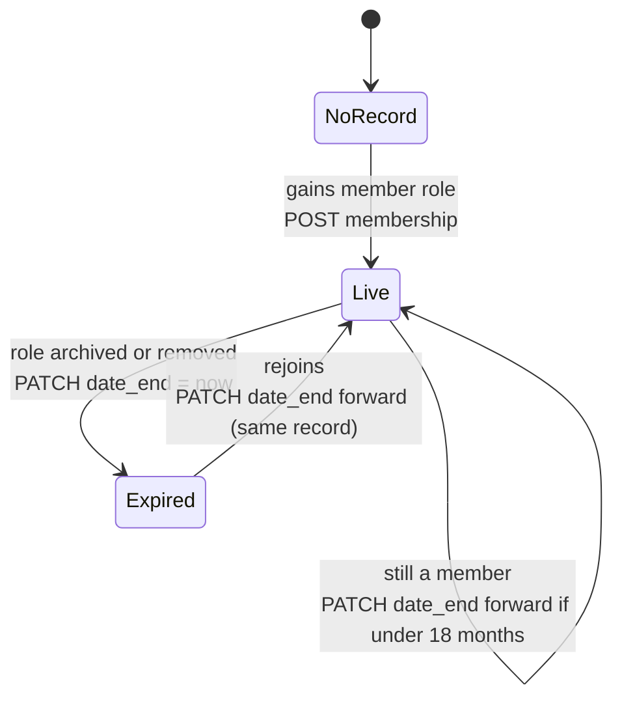

# Syncing member status to pretix

Member ticket prices in the pretix shop are gated behind a pretix **membership**. This document
specifies how that membership is driven from the website's `member` role instead of from a
product the member has to remember to buy.

Status: specified, not yet built. The one-off data fix in [Rollout](#rollout) step 0 is done.

## Why

Members used to activate themselves by buying a free "membership activation product" once a year.
That produced three standing problems:

1. Regular ticket buyers could not create pretix accounts, because native login had been turned
   off to force everyone through SSO.
2. Members did not notice they had to activate, so they paid full price.
3. Nothing tied a pretix membership back to *this year's* member list, so a membership granted in
   2023 kept working.

Making the website the single source of truth fixes all three: the shop can no longer grant a
membership at all, so there is nothing to forget and nothing to leak between years.

## What pretix actually does

These are the constraints the design has to survive. All verified against the live API and the
pretix source, August 2026.

**A membership is checked against the *show's* date, not the purchase date.**
`Membership.is_valid` resolves `dt = ev.date_from` and requires `date_start <= dt <= date_end`.
The same window filters the checkout dropdown (`Customer.usable_memberships(for_event)`) and is
re-checked at order validation, which raises *"You selected a membership that is valid from
{start} to {end}, but selected an event taking place at {date}."* So `date_end` caps **how far
ahead a member can book**, not merely when they lapse. This is why the cohorts ending 31 August
silently blocked every autumn show, and why a short rolling window is not an option.

**Memberships cannot be deleted.** The API answers DELETE with *"Memberships cannot be deleted.
You can change the date instead."* Revoking means `PATCH date_end` into the past. The model has a
`canceled` flag but it is absent from the API serializer, so it is unreachable.

**Customers cannot be pre-created**, and trying breaks the member. pretix keys an SSO account on
`sha256(claim + '@' + provider_pk)`; an API-created customer has no provider, so the member's next
login fails to match it, tries to insert, and dies on the unique-email constraint — they see
*"the email address is already used for a different account in this system."* Accounts appear on
first login and only then.

**The identity claim is `email`, not `sub`** — 686 of 686 SSO customers carry an email address in
`external_identifier`, so that is the join key. Do **not** switch the claim to `sub` to match
`User#id`: it re-hashes every identifier at once and orphans all 686 accounts along with their
order history. One-way door. The cost of leaving it is that a member who changes their website
email gets a fresh empty pretix account on next login; that is a pre-existing bug, not one this
sync introduces.

**There are no customer or membership webhooks**, so nothing here can be event-driven from
pretix's side. See [Triggers](#triggers).

### Fixed values

| Thing | Value |
|---|---|
| Organizer | `eutc` (pretix Hosted — `/control/` redirects to pretix.eu, so no custom plugins) |
| Membership type | `225`, "EUTC Member" — `max_usages: null` (unlimited), `allow_parallel_usage: false`, `transferable: false` |
| Customer lookup | `GET /organizers/eutc/customers/?email=` — `email` is the only filter offered |
| API permission | `organizer.customers:read` + `:write` (team flag "Can manage customer accounts") |

`allow_parallel_usage: false` is deliberate: one discounted seat per member per performance.

## The model: one membership, forever

Each person gets **exactly one** membership record, created the first time they are a member and
never replaced. The sync only ever moves `date_end`.



Annual cohorts are not recreated. Rejoining reuses the existing record, so order history and
identity stay attached to one row, and the September re-import restores pricing instantly rather
than minting a new membership.

**`date_end` while a member** is the end of the *next* academic year plus three weeks — today,
`2027-09-21T23:59:59+01:00`. The horizon therefore sits between roughly 13 and 24 months, which
keeps it clear of anything ever on sale while still expiring on its own within two years if the
sync dies. The three weeks are slack for the manual September rollover.

The reconcile refreshes `date_end` only when it falls below 18 months out, so most nights it
writes nothing.

**`date_end` when not a member** is set to now. Losing the role means losing member pricing
immediately — no grace period — which matches the website, where an archived role stops being a
membership at the same instant.

**`date_start`** is left alone on an existing record and set to the start of the current day on a
new one. It never needs to move: everything bookable is in the future, so widening the window
backwards over a lapsed year cannot grant anything.

### What this gives up

pretix stops carrying any record of *which years* a person was a member — the website's archived
roles (`member 24/25`) become the only history. Acceptable while the website is the source of
truth, but it means membership counts can no longer be reported out of pretix.

## Triggers

No webhooks exist, so the sync is driven from our side. The nightly reconcile is the one that
actually guarantees correctness; the other two only make it feel immediate.

1. **On login** — Doorkeeper's `after_successful_authorization` (config/initializers/doorkeeper.rb)
   enqueues a sync for that user. On a member's *first ever* pretix login the customer does not
   exist yet at that moment, so the job needs a short delay and a retry; worst case they see
   non-member prices for about a minute, once.
2. **On role change** — `User#activate`, the membership import apply, `Role#purge` / `#archive`,
   and admin role edits.
3. **Nightly reconcile** — the safety net, and the only thing that catches the September archive,
   revocations, and anything the first two missed.

## Reconcile algorithm

```
customers  = GET /organizers/eutc/customers/        (paginated, ~875)
memberships = GET /organizers/eutc/memberships/     (paginated, type 225)

for each customer with an external_identifier:
    user     = User.find_by(email: customer.external_identifier)
    entitled = user&.has_role?(:member) || user&.has_role?("life member")
    mine     = memberships for this customer, type 225

    canonical = mine.min_by(&:date_start)       # widest window
    others    = mine - [canonical]

    expire(others)                              # collapse duplicates to one

    if entitled
        canonical ? extend(canonical) : create(customer)
    else
        expire(canonical)
```

`extend` is a no-op unless `date_end` is under 18 months out. `expire` is a no-op if `date_end` is
already in the past. Both keep the nightly run near-silent.

**Pagination is not stable under writes.** pretix orders memberships by `-date_end`, so a patched
record jumps to the front of the list and shifts every later page — a fetch-then-patch pass can
skip records if anything writes concurrently. Fetch the full list before writing, and re-fetch and
repeat until a pass finds nothing to do. This bit us during the step-0 backfill: a run reported
"89 patched, 0 failed" while 16 records were still stale.

**Duplicates are real**: 198 live memberships across 125 customers before the first reconcile.
They are double-activations, not allowance top-ups — `max_usages` is null, so one membership
already buys unlimited member tickets.

## Rollout

Order matters. Step 3 must not happen before step 2, or anyone with a pretix account could still
grant themselves a membership.

0. **Done (26 Aug 2026)** — pushed `date_end` on all 198 live type-225 memberships to
   `2027-09-21T23:59:59+01:00`. They were expiring on 31 August, which had already blocked member
   pricing for the whole autumn programme. This grants nobody anything new; over-inclusion is
   corrected by the first reconcile.
1. Ship the sync and let the nightly reconcile run clean for a few days.
2. **Delete the membership activation product**, so nothing in the shop grants a membership.
3. Re-enable native email+password login (Organizer → Settings → General → Customer accounts).
   189 native accounts already exist and none collide with an SSO account today, so nobody is
   locked out. Forward risk: a member who later creates a native account on their Bedlam email
   locks themselves out of SSO.
4. September rollover, unchanged for whoever runs it — archive `member`, import the new list. The
   reconcile expires everyone on archive and restores them as the import lands.

## Open items

- Production member counts were never obtained (`kamal app exec` is blocked by the permission
  classifier), so "members who logged in but never activated" is still unquantified. 125 customers
  activated for 25/26, against roughly 175 members in each of the previous two cohorts.
- The email-change orphaning above has no mitigation. Warning on email change, or reconciling
  orphaned customers by matching a former email, would both work; neither is specified here.
