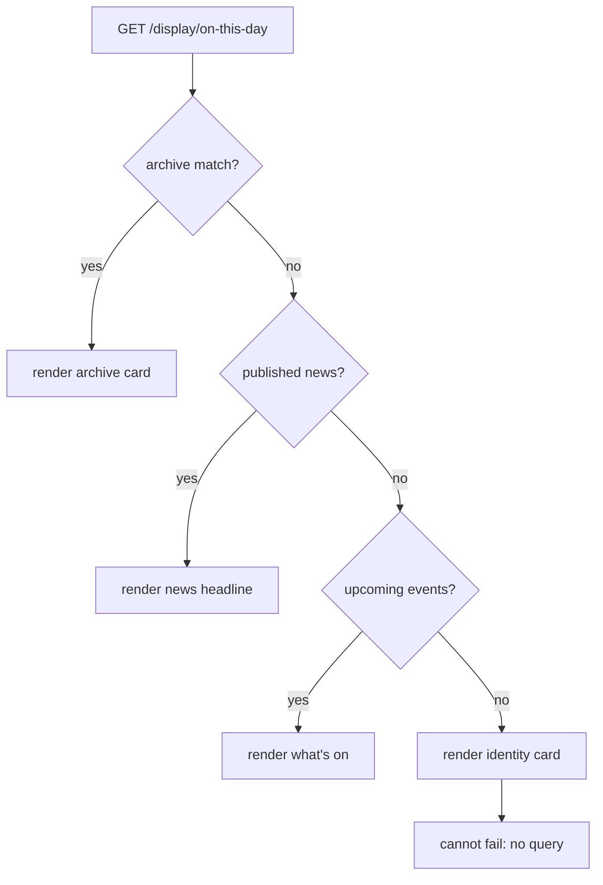

# The box office display

## The problem

The box office has an Anthias (formerly Screenly) screen driven by a Raspberry Pi. Anthias plays a
**fixed playlist of URLs**, each for a set duration, forever. Nobody edits that playlist between
shows, and whoever runs Front of House next year will not know it exists.

That single fact drives the whole design. A page that renders nothing on a quiet Tuesday is not a
blank page for a moment — it is a blank screen in the box office until someone notices and
re-configures the Pi. **Every URL in the playlist must render something, always.** The site has
plenty of content to show; the work is making "always" a structural property rather than a
promise.

A second problem sits underneath it. The site models an event as a name and a date *range*, with
no times and no notion of which nights it actually plays. That is fine for a listings page and
useless for a screen that has to answer "what is on tonight".

## Decisions

These are settled. They cost real deliberation and should not be re-litigated during
implementation.

**Every page falls back; the chain always ends somewhere that cannot fail.** Each page is the
first *available* panel from an ordered list, and the last entry in every list is an identity card
that renders with an empty database. This is the feature. It is not error handling bolted on
afterwards, and no page may be written that queries directly and hopes.

**Blank `performance_weekdays` means every day of the run, including weekends.** Not Monday to
Friday. This is exactly what a date range means today, so **every existing row keeps its current
meaning and nothing needs backfilling** — nobody has to invent performance days they do not know.
Only genuinely intermittent events ever get a value.

**Duration cannot substitute for weekday data.** The tempting shortcut is "anything longer than N
days is ongoing, exclude it". It is wrong: a three-week Fringe run is also a long date range and
genuinely *is* on every night. Excluding it would blank the screen during the one month the box
office is busiest. Only real performance days can answer "is it on tonight".

**The Improverts stop being a special case.** With a weekday value they gain a computable *next
occurrence*, so they sort into the ordinary chronological pool as "this Friday" and move through
it like any other event. There is no residency strip, no exclusion list, no branch anywhere that
names them.

**Every event type is in the pool, seasons included.** A `Season` is normally a festival — a
short run, and exactly the sort of thing the box office should be advertising — not a term-long
container. Excluding the type would drop the content the screen most wants. There is no type
filter and no duration rule anywhere in the pool: the single lever for an unusually long run is
`performance_weekdays`, which is the same lever the Improverts use.

**Anything running today sorts to the front of the pool.** So `/display/next/1` is automatically
tonight's show whenever there is one, and simply the next show otherwise. There is no separate
"tonight" URL to fall back from.

**Slots wrap.** Six slots against four upcoming events means slots 5 and 6 repeat events 1 and 2.
Repeating a poster is strictly better than a dark screen, and it keeps the playlist a fixed length.

**No curtain times anywhere.** The schema has none — `start_date` and `end_date` are dates. The
screen will not print a time it cannot source. Adding one is a separate change (see Out of scope).

**"On this day" reuses `Event.on_date`.** That scope compares month and day within a single
year, so a run crossing new year would match in neither month. Bedlam does not programme across
the new year, so the gap is theoretical, and a second scope kept in step with the first costs more
than it saves.

**Real artwork is a hard requirement for "on this day".** `Event#fetch_image` *attaches a
generated placeholder* when nothing is uploaded, so checking for an image after calling it passes
for everything. The guard is a join on the attachment, applied in the query.

**The display layout must not load the public `application.css`.** That stylesheet carries
unlayered `h1`–`h6` rules that beat Tailwind utilities, so every size we set would be fought by it.
A dedicated layout and stylesheet avoids the problem rather than papering over it with
`!important`.

## Data model

One additive, nullable column:

```
events
  + performance_weekdays  string(255), NULL
```

Comma-separated `Date#wday` integers — **0 is Sunday**, matching Ruby. The Improverts are `"5"`.
`NULL` or blank means every day of the run.

Nothing hand-edits this: the admin event form gains seven checkboxes. `normalizes` sorts and
dedupes; a validation rejects anything outside 0–6.

Two readers on `Event`:

```ruby
# The days this event plays. Empty means every day of the run.
def performance_wdays = performance_weekdays.to_s.split(",").map(&:to_i)

def on_today?(date = Date.current)
  return false unless (start_date..end_date).cover?(date)
  performance_wdays.empty? || performance_wdays.include?(date.wday)
end

# The next date this event actually plays, on or after `from`. nil if it never
# plays again. Weekdays repeat, so the answer is always within 7 days of the
# range start -- no need to walk the whole run.
def next_occurrence(from = Date.current)
  from = [from, start_date].max
  return nil if from > end_date
  return from if performance_wdays.empty?

  (from..[from + 6, end_date].min).find { |d| performance_wdays.include?(d.wday) }
end
```

## The event pool

`Display::EventPool.upcoming` is the single ordered list feeding the six slot pages, the What's On
board and the credits page.

```ruby
Event.current
     .includes(image_attachment: :blob)
     .to_a
     .select { |e| e.next_occurrence(on).present? }
     .sort_by { |e| [e.on_today?(on) ? 0 : 1, e.next_occurrence(on)] }
```

Sorting happens in Ruby, not SQL. The pool is a handful of rows and the weekday logic does not
belong in a query. An event whose remaining run contains none of its performance days drops out.
Shows, workshops and festivals all flow through unfiltered.

Slot *n* renders `pool[(n - 1) % pool.size]`.

## Panels and the fallback chain

A panel is a PORO in `app/services/display/panels/` answering three questions: `available?`,
`partial`, `locals`. `Display::Chain` takes an ordered list and returns the first available one.



The chains:

| URL | Panel chain |
|-----|-------------|
| `/display/next/1` … `/6` | NextEvent(slot) -> WhatsOn -> News -> Identity |
| `/display/whats-on` | WhatsOn -> NextEvent(1) -> News -> Identity |
| `/display/tonight-credits` | Credits -> NextEvent(1) -> WhatsOn -> Identity |
| `/display/get-involved` | GetInvolved -> WhatsOn -> News -> Identity |
| `/display/news` | News -> WhatsOn -> GetInvolved -> Identity |
| `/display/on-this-day` | OnThisDay -> News -> WhatsOn -> Identity |

`Identity` renders the Bedlam mark and the website address. It runs no query and is therefore the
one panel that is always available.

## The pages

**Next event (six slots).** Full-bleed artwork with the text over a bottom gradient band —
`large_display_variant` is 1920x1200 `resize_to_fill`, so the artwork is landscape already and
crops cleanly to 1080p. Carries name, author, tagline, dates, price, and a QR code. When the
event `on_today?`, the page renders in **tonight mode**: a `TONIGHT` eyebrow and the content
warnings, which currently appear nowhere but the show page.

**What's On.** The upcoming pool as a board: date, name, venue, price. Eight rows.

**Tonight's credits.** Tonight's show, else the next show. `TeamMember.ordered`, split into Cast
and Company by the existing `TeamMember#cast?`. Available only when the event has at least one
team member. Type sizes to fit rather than overflowing — casts run large.

**Get involved.** `Opportunity.active` with roles, five items, QR to the opportunities page.

**News.** The latest `News.where(show_public: true).current` item: headline, standfirst, date.

**On this day.** Oldest match, so the pick is deterministic across fetches and the archive
material is at its most striking. The guards, all applied in the query:

```ruby
Event.on_date(Date.current)
     .where(is_public: true)
     .where("end_date < ?", 1.year.ago.to_date)     # not this season's show
     .where("DATEDIFF(end_date, start_date) <= 60") # not a residency or a term-long run
     .joins(:image_attachment)                      # real artwork, not the placeholder
     .reorder(:start_date)
     .first
```

`reorder`, not `order`: `Event` carries `default_scope -> { order("end_date DESC") }`, so `order`
would append to it and the "oldest match" would silently be the one ending latest.

## QR codes

`rqrcode` is already in the Gemfile. Rendered as **inline SVG**, so the pages make no external
requests and nothing has to be added to the CSP. A slot page links to
`PretixHelper#pretix_event_url` when the event is `pretix_shown`, otherwise to the event page.

## Routes, layout, delivery

```ruby
namespace :display do
  root to: "setup#show"
  get "whats-on",        to: "pages#whats_on"
  get "next/:slot",      to: "pages#next_event", constraints: { slot: /[1-6]/ }
  get "tonight-credits", to: "pages#credits"
  get "get-involved",    to: "pages#get_involved"
  get "news",            to: "pages#news"
  get "on-this-day",     to: "pages#on_this_day"
end
```

Public and unauthenticated — everything shown is already public on the site — with
`skip_authorization_check`, `noindex`, and `Cache-Control: no-store` so Anthias can never hold a
stale frame.

`/display` itself is a setup page listing every URL with a suggested duration, so whoever
configures the Pi copies them off a page instead of out of a chat log.

## Testing

**The guarantee gets a test.** Every display route is fetched twice: once against fixtures, once
against an emptied database, asserting 200 and non-blank body both times. Emptying needs deletion
in dependency order — `TeamMember`, `Review`, `Picture`, `Admin::Questionnaires::Questionnaire`,
`Admin::Feedback`, then `Event` — because all of those associations are `restrict_with_error`.

Beyond that:

- `Event#next_occurrence` and `#on_today?`: blank weekdays, a Friday-only run, a run whose tail
  contains no matching day, and a `from` before `start_date`.
- Pool ordering: an event on today sorts ahead of an earlier-starting one that is not.
- Slot wrap-around: four events across six slots yields 1,2,3,4,1,2.
- A `Season` sorts into the pool like any other event.
- Each On This Day guard rejects its case.
- One `vischeck` pass on the real layouts at 1920x1080.

## Out of scope

Curtain times (needs a `curtain_time` column or a `Performance` model — the latter is the eventual
correct fix and would subsume `performance_weekdays`); the reviews/press page, membership and
newsletter pages; bar and cafe prices, seating plan, accessibility copy and the Fringe programme,
all of which are graphics the Marketing Manager makes; portrait layout; and provisioning the Pi
itself.
