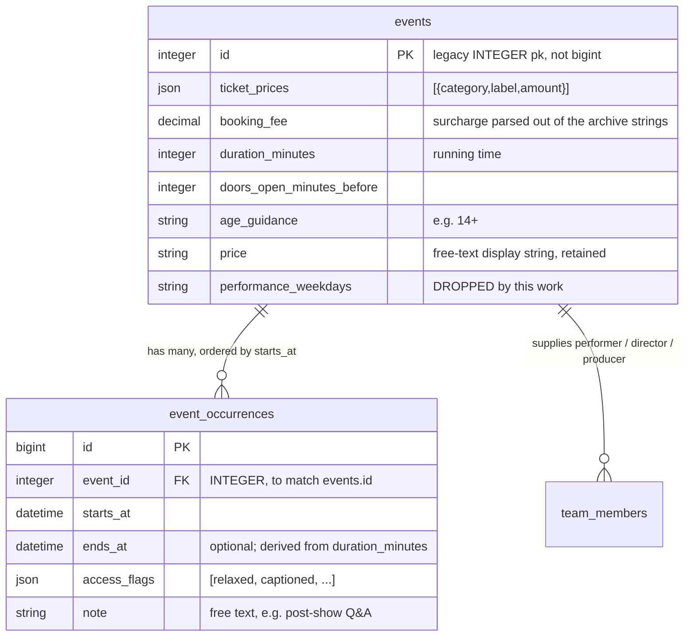

# Rich event data: performances, structured prices, and the fields the schema needs

**Date:** 2026-08-30
**Status:** implemented on `rich-event-data` (phases 1–4); backfill written, not yet applied

## Why

An `Event` today states its dates as two `date` columns, its price as one free-text string, and
which nights it plays as a comma-separated list of weekday numbers. Everything else a theatre
listing needs — curtain times, a relaxed performance, a running time, an age guidance, what each
ticket band actually costs — lives in prose inside `publicity_text`, where nothing can read it.

That has three costs:

1. **The box office display cannot print a curtain time.** `docs`/CLAUDE.md already record this
   as a schema limitation: "There are no curtain times in the schema."
2. **The structured data is as thin as the columns.** `SchemaHelper#event_schema` emits a
   date-only `startDate` and scrapes `offers` out of the price string with a regex, because
   there is nothing better to read. The SEO audit named this the single biggest remaining upgrade
   to the event rich results.
3. **Nobody can answer "when is the relaxed performance?"** except by reading the blurb.

## Decisions

Settled with Mick before writing this, and the reasoning is recorded because each one had a live
alternative:

| Decision | Chosen | Rejected, and why |
|---|---|---|
| Price storage | JSON column on `events`, typed in the admin | Live pretix reads — pretix has no prices for the ~3000 archive events or for Fringe-box-office shows, and it would make the schema.org output depend on a third-party API being up |
| Performance storage | One `EventOccurrence` table, label varying per STI subclass | Per-type tables — triples the admin forms, display code and tests for the same three columns |
| `performance_weekdays` | Dropped outright, no backfill | Backfilling fabricates curtain times we do not know for 3000 archive rows |
| Fee clauses in the archive | Parsed, and the fee stored | Discarding them loses ~120 rows including 39 since 2015 |

## Data model



`events.id` is a legacy `INTEGER` primary key. `event_occurrences.event_id` **must** be declared
`type: :integer`; a bigint FK aborts the migration with a column-type mismatch.

## 1. `EventOccurrence`

One model, three names. `belongs_to :event`, ordered by `starts_at`, edited through
`accepts_nested_attributes_for` exactly as `Admin::Staffing` edits its staffing jobs, with
`has_paper_trail`. It is a child managed only through its parent, so it goes on the exclusion
list in `Admin::PermissionsController` rather than appearing in the permission grid.

```ruby
Event::OCCURRENCE_LABEL     # "Date"
Show::OCCURRENCE_LABEL      # "Performance"
Workshop::OCCURRENCE_LABEL  # "Session"
Season::OCCURRENCE_LABEL    # "Opening time"
```

The label is a class constant, not a string typed into each view, so the admin form, the public
page and the box office screen cannot drift apart on what to call these.

- `ends_at` is optional and derived from the event's `duration_minutes` when blank.
- `starts_at` is validated to fall within `start_date..end_date`. Without that, the run dates and
  the performance list can state contradictory facts with nothing to catch it.
- `access_flags` is a JSON array checked against a constant allow-list: `relaxed`, `captioned`,
  `audio_described`, `bsl`, `preview`, `press_night`, `post_show_discussion`. A constant rather
  than seven boolean columns, so adding a flag is one line rather than a migration.
- `note` carries anything the flags do not.

## 2. Retiring `performance_weekdays`

The column goes. What stays is the rule it encoded: **blank means every day of the run.**

| | before | after |
|---|---|---|
| `on_today?` | in range, and the weekday matches (or no weekdays set) | an occurrence falls on that date; **no occurrences → in range**, exactly as now |
| `next_occurrence` | next matching weekday, returns a `Date` | next occurrence's date; none → first date in range. Still a `Date`, because `Display::EventPool` sorts on it |
| `next_occurrence_at` | — | new; returns the record, so the display can print a curtain time |
| `display_when` | "Every Friday" / date range | "Tonight, 7.30pm" / "Fri 3 Oct, 7.30pm"; falls back to the range |

Every archive event, having no occurrences, keeps precisely today's behaviour. The Improverts —
the one event currently using weekdays — is not running, and by Mick's decision gets no special
handling; its dates are re-entered by hand if and when it returns.

Dropping a column is irreversible, so that commit is not merged autonomously.

## 3. Prices

`ticket_prices` is a JSON array wrapped by `Event::TicketPrice`, an `ActiveModel::Model` with
`category` (`standard` / `concession` / `member` / `other`), `label` (used only by `other`) and
`amount`.

A hand-written `Event#ticket_prices_attributes=` makes `f.simple_fields_for` treat the collection
as a nested association — `fields_for` only checks that the parent responds to
`#{name}_attributes=` — so the **existing** nested-form Stimulus add/remove UI drives it with no
new JavaScript. One snag: `shared/form/sections/_nested_fields` builds its "add row" template via
`reflect_on_association`, which a JSON-backed collection does not have. That partial gains an
optional `template_object:` local. A near-copy of the partial would have been the obvious
alternative and would fail `jscpd`, which gates duplication at threshold 0.

No validation that standard is the dearest band — it usually is, but only usually. Display sorts
by amount descending.

**`price` remains the display string.** Every existing reader (`events/_basic_info`, both display
panels, `admin/events/_basic_show`) keeps working untouched. Editing prices in the admin
regenerates `price` from the structured rows via `before_validation`, so the two cannot drift; the
backfill deliberately does not, so the archive renders byte-identically to today. Leave the
structured rows empty and a curator can still type "Pay what you can" by hand.

## 4. Backfilling the archive

`Event::PriceParser.parse(string)` returns an array of `TicketPrice` plus an optional booking fee,
or `nil` for "I cannot read this". Designed against the real production distribution, read on
2026-08-30: **2742 events carry a price, in 461 distinct strings across 178 shapes.**

### The pre-decimal trap

66 rows are in shillings and pence — `"2/-, 3/-, 4/-"`, `"3/6, 4/6, 6/-"`, `"3s 6d, 5s, 6s 6d"`,
`"6d"`. Their year range is **1893–1970**, ending exactly at decimalisation (15 February 1971).

A naive "split on `/`" reads `"2/6, 3/6, 5/-"` as five modern prices of £2, £6, £3, £6 and £5 —
and the output looks entirely plausible. Worse, a marker regex does not save you: a bare `"5/6"`
on a 1962 show is 5s 6d and nothing in the string says so.

**So the rule is date-based, not string-based: refuse every event whose `start_date` precedes
1971-02-15.** That is ~310 rows across the 1890s–1960s, which are historical records rather than
bookable events and have no search value. It is provably safe against this dataset, whose newest
shilling row is 1970.

### Parsing rules

- Separators `/` and `//`. Each part: optional `£`, a number, optionally a category word
  (`concession(s)`, `conc`, `member(s)`, `student(s)`, `unwaged`, `full`, `standard`, `adult`).
- **Categories are assigned by amount, not by position.** `"3/4/5"` and `"7/8/10"` (ascending) and
  `"£5.50/5/4.50"` and `"£4/£3.50/£3"` (descending) all appear in the real data; sorting by amount
  reads all four correctly with one rule. Dearest → standard, then concession, then member.
- Parenthetical bands: `"£5/£4.40 (£4 Members)"`, `"£3 (£2.50 concessions)"`.
- `"30p"` / `"75p"` → £0.30. Pre-decimal pence is `d`, so any surviving `p` after the date gate is
  decimal.
- `Free`, `FREE`, `Free!`, `Free Unticketed`, `0` → a single £0 standard, which also earns
  `isAccessibleForFree`. This is ~155 rows since 2015 alone.
- **Fee clauses are parsed and the fee is stored** in `booking_fee`, against a closed allow-list of
  suffixes: `+ £N booking fee on the door`, `+ fees`, `+ £N on the door`, `(+N on the door)`,
  `+£N booking fee`, and the `+ fees, £N booking fee on the door` combination. `+ fees` with no
  figure leaves `booking_fee` nil — we know a fee existed, not what it was. The fee is stored and
  displayed but is **not** folded into the schema.org `offers`, which describe the ticket.
- Four or more amounts with no category words → refuse. There is no fourth category to name, and
  inventing one is the failure this parser exists to avoid.
- Anything else with leftover prose → refuse. `"Unknown"` alone is 1019 rows; `TBC`, `N/A`, `?`,
  `--`, `-`, `Various`, `Varying`, `from £N`, `pay-what-you-can`, `$5` follow.

### Plausibility guards

Two more refusals, found by sweeping the *readable* parses rather than the refusals — both came
back as confident, ordinary-looking output, which is what made them worth catching:

- `"150"` read as a £150 ticket. Bedlam is a 90-seat student theatre; it is £1.50 typed without
  the dot. Anything over **£100** is refused.
- `"1/75"` read as £75 standard against a £1 concession. It is £1.75 typed with a slash. A ratio
  over **10x** between the dearest and cheapest paid band is refused. Zero bands are excluded, so
  a genuine free-plus-paid pair (`"0/1.50"`) still reads.

### The task

`bin/rails events:backfill_ticket_prices` **defaults to a dry run**: every distinct string, what
it parsed to, and every refusal with counts. `APPLY=1` writes, through `update_columns`, so
`ticket_prices` and `booking_fee` move and nothing else on the row does. The dry run is reviewed
against production before anything is applied.

The governing asymmetry, as with `Reconciliation.detect_offsetting_pairs`: a wrong parse writes a
wrong price into structured data that search engines then publish, while a refusal leaves the row
exactly as it is today. Prefer refusing to guessing.

### What the dry run says, against production

Run 2026-08-30 over all 2742 rows:

| | rows | share |
|---|---|---|
| Readable | 1370 | 50.0% |
| Refused on the date (pre-decimal) | 324 | 11.8% |
| Unreadable | 1048 | 38.2% |

795 of the unreadable are literally `"Unknown"`, plus `Various` (46), `N/A` (31), `TBC` (30) and
the rest of the placeholder junk — 103 distinct strings in all. The refusals worth knowing about:
`"4.00 (3.00)/2.00/1.00"` (6 rows, four amounts with nothing to name the fourth),
`"Full price £12.00, Student and unwaged £10.00"` (2 rows — a band word *preceding* its amount,
which the scanner does not read), and `"£2/£3 + fees; £3/4/5 + fees in person"` (2 rows, two
price schemes in one string).

## 5. Extra fields

`duration_minutes`, `doors_open_minutes_before` and `age_guidance` on `events`. All three are
currently buried in `publicity_text` prose where nothing can read them.

## 6. Structured data

This is the upgrade CLAUDE.md already names as the biggest one outstanding.

- **One `TheaterEvent` per occurrence**, in a `@graph`, each with a real datetime `startDate`, a
  `superEvent` link to the parent, `doorTime`, its own `offers` and its accessibility flags. The
  parent gains `subEvent`.
- **`offers` from `ticket_prices`** — an `AggregateOffer` plus one named `Offer` per band. The
  existing `PRICE_PATTERN` scrape stays as the fallback for rows the parser refused.
- **`workFeatured`** → `{ @type: Play, name:, author: Person }` from the existing `name` and
  `author` columns. Shows only — a workshop is not a play. `director` and `producer` are matched
  from `TeamMember#position` segments, which are free text split on `/`.
- `duration` as ISO 8601 (`PT2H15M`), `typicalAgeRange` from `age_guidance`,
  `isAccessibleForFree` when every band is zero.

## 7. Public and display surfaces

The show page gets a performances table — time, flags as badges, and a per-night booking link
where pretix is enabled — under the existing basic info block. Prices stay as the `price` string;
`£10 / £8 concessions` is already compact and correct.

On the box office screen the curtain time joins the existing `display_when` span, **staying on the
same line**. `_whats_on`'s marquee arithmetic is pinned to hand-summed heights (`h-18`, `h-9`, the
`17.25rem` viewport constant), so a second line would silently push the QR code off-screen. This
gets verified in a browser, not by reasoning about it.

## 8. Testing

- Model: occurrence validation, and `on_today?` / `next_occurrence` proved in both directions —
  with occurrences and without, the latter being the archive's behaviour.
- `Event::PriceParser`: a table-driven test over the real production shapes, including the
  pre-decimal rows, both orderings, and every refusal class.
- Helper: `display_when` with a curtain time; `SchemaHelper` for sub-events, structured offers,
  `workFeatured`, and the fallback to the old scrape.
- Functional: admin create/update with nested occurrence and price params. Request-level, not
  browser — the markdown editor cannot be driven by Playwright `fill`.
- System: the nested-form add/remove buttons, which do verify fine in a browser.
- The existing display tests asserting blank-weekday behaviour are updated deliberately. The
  empty-database display test is the feature and must keep passing.

## What changed from the design during implementation

- **`accessibilityFeature` is filtered and mapped.** The first cut published every flag verbatim,
  which said a press night was an accessibility feature. Only `captioned`, `audio_described`,
  `bsl` and `relaxed` are published, in schema.org's own vocabulary.
- **Two plausibility guards were added to the parser** after sweeping the readable parses; see §4.
- **The box office board needed its own compact price** (`display_price`): the derived string
  truncates in that fixed-width column.
- **Prices are stored dearest-first on read, not on write**, so the raw JSON keeps what was
  entered.

## Follow-up: reading the performances back as a shape

Added after review. Listing every performance was right for storage and wrong for display: a
five-night run showed as five near-identical rows on the event page, and the board showed only the
next one, having lost the run it used to print.

`Event::Schedule` classifies an event's occurrences as `:range`, `:weekly`, `:single`,
`:irregular` or `:none`, and both surfaces render from it. `:weekly` is what replaced the retired
`performance_weekdays` column, now derived from real dates and knowing the curtain time.

- Blocks group by curtain time before folding consecutive dates, or a Saturday matinee cuts the
  evening run in three.
- A run states the whole run, not the remainder.
- A collapsed range names its exceptions underneath, or "which night is relaxed" is lost — the
  thing people scan the list for.

## Phases

Each is its own commit; the whole runs in the `rich-event-data` worktree.

1. `EventOccurrence` + retiring `performance_weekdays`
2. `ticket_prices`, `Event::TicketPrice`, the admin form, `PriceParser` + the backfill task
3. `duration_minutes`, `doors_open_minutes_before`, `age_guidance`
4. `SchemaHelper` rewrite + the public and display surfaces

## Deferred

- **Prices are per event, not per occurrence.** A differently-priced preview would need
  per-occurrence overrides. No current show does this.
- **No pretix price sync.** Prices are typed in the admin.
- **No `eventStatus` or venue capacity.** Cancelling a single night still has nowhere to be
  recorded; `Venue` has no capacity column, so no `maximumAttendeeCapacity`.
