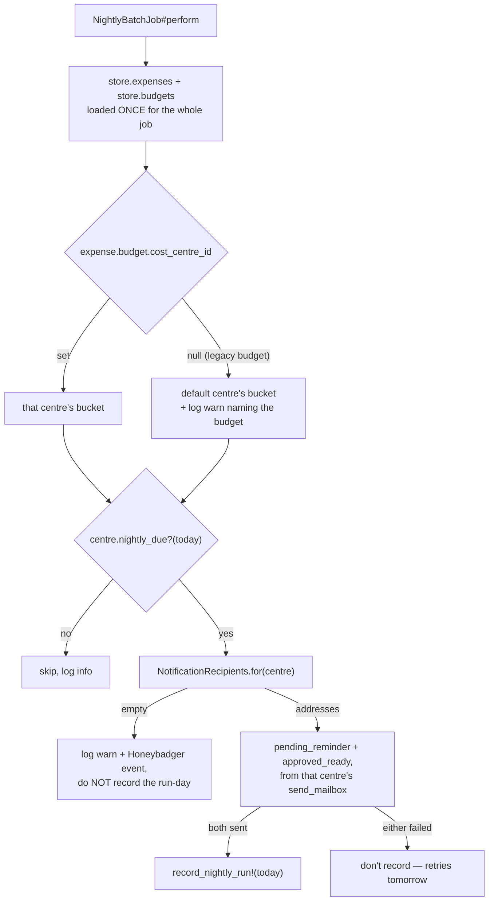

# Per-cost-centre finance notifications

**Date:** 2026-08-31
**Status:** design approved, pending implementation plan

## Problem

Every admin-facing reimbursements notification goes to one global list. `NightlyBatchJob#compute_operator_emails` resolves *every user in every role* holding the grid permission `manage` / `reimbursements_finance` (or the single `REIMBURSEMENTS_OPERATOR_EMAIL` override, which replaces the lot). There is no cost-centre filter anywhere in it.

That is tolerable while Fringe (F40) is the only live cost centre. It stops being tolerable the moment termtime (BED) goes live: every Fringe admin would get termtime's reminders and vice versa.

Underneath the recipient list sits a second, larger globality. `reimbursements_expenses` carries no cost-centre link — a claim resolves its centre only through `budget -> cost_centre`, and `budgets.cost_centre_id` is nullable. So the Pending and Approved queues the nightly reads are global, which is why `NightlyBatchJob#deliver_reminders` carries a `TODO(mysql)` and hard-skips every non-default cost centre: a second due centre reminding on the same global queue would send the same operators a duplicate of each reminder. `docs/reimbursements/mysql-migration-and-roadmap.md` lists this as required before a second cost centre goes live.

## Inventory: the notifications in scope

| # | Notification | Sent by | Trigger | Recipients today | In scope |
|---|---|---|---|---|---|
| 1 | `pending_reminder` | `NightlyBatchJob` | Pending claims older than `PENDING_REMINDER_DAYS` (3) awaiting approval | all finance-permission users | **yes** |
| 2 | `approved_ready` | `NightlyBatchJob` | The whole Approved queue, with needs-attention flags | all finance-permission users | **yes** |
| 3 | `failure` | `NightlyBatchJob` | The nightly run raised | all finance-permission users | **yes** |
| 4 | `batch_ready` | `BuildBatchJob` | EUSA draft created, awaiting manual send | only the operator who clicked Build Batch | no |
| 5 | `failure` | `BuildBatchJob` | The batch build failed | only that same operator | no |
| 6 | `secret_expiry_warning` | `CredentialsCheckJob` | Entra client secret expires within 30 days | `Settings.alert_email` (IT) | no |
| 7 | `auth_failure` | `GraphAuthAlert` | Graph app-only credential failing | `Settings.alert_email` (IT) | no |
| 8 | `digest` | `OwnerEndorsementDigestJob` | Pending claims awaiting a budget owner's sign-off | each budget's own owners | no |

1-3 already *send* from the cost centre's `send_mailbox` and already carry its `subject_prefix`, so the emails are distinguishable; only the address list and the underlying queue are global. That is the whole of what changes.

4-5 stay clicker-only (Mick, 2026-08-31): out of scope for this change.

6-7 stay on `Settings.alert_email`. There is one Entra app for the whole org, so a credential failure is not a per-centre event and routing it per centre would be wrong.

8 is already scoped by budget ownership, which is per-centre by construction once budgets carry `cost_centre_id`.

## Scope decisions (Mick, 2026-08-31)

In scope:

- **Notification recipients** become per cost centre.
- **The nightly's queues** become per cost centre, removing the `TODO(mysql)` hard skip.

Explicitly *not* in scope:

- **Screen scoping.** No `?centre=` selector on Review / Expenses / Budgets / Batches / Reconcile.
- **Access gating.** `manage` / `reimbursements_finance` stays a global permission: a Fringe admin can still open a termtime claim. This change is about who gets *told*, not who can *see*.

## Design

### 1. A notification role per cost centre

`CostCentre` gains `belongs_to :notification_role, class_name: "Role"` with a presence validation.

A `Role` rather than a join table or a free-text address list, because roles are the committee-membership machinery this society already runs on: adding someone to "Fringe Finance" is the same gesture as every other committee handover, and the role's members are real accounts, so an address can't rot into a person who left. Unlike `member`, these finance roles are **not** part of the annual `Role#archive` sweep, so the "archive empties the role" failure mode does not arise.

Migration:

```ruby
add_reference :reimbursements_cost_centres, :notification_role,
              type: :integer, foreign_key: { to_table: :roles }, index: true
```

**`type: :integer` is load-bearing.** `roles` is a legacy table with an integer primary key (`db/schema.rb`: `create_table "roles", id: :integer`). A default bigint reference would abort the FK migration with a column-type mismatch.

Edited on the cost centre's existing Settings page (`Admin::Reimbursements::SettingsController#edit`), where the rest of a centre's operational config already lives. The picker is a `.simple-select2` / Tom Select widget like the other admin selects — which means Capybara's `select` cannot drive it; a system test must click `.ts-control` then the `.ts-dropdown-content .option` (see `test/system/admin/reimbursements/producer_js_test.rb`), or the case is covered at request level instead.

### 2. One recipient-resolution path

A small PORO, replacing `NightlyBatchJob#compute_operator_emails`:

```ruby
Reimbursements::NotificationRecipients.for(cost_centre)
```

- The global `REIMBURSEMENTS_OPERATOR_EMAIL` override wins first, unchanged. It is the "divert everything to one inbox" switch and must stay whole-portal, not per centre.
- Otherwise: the notification role's users' emails, `compact_blank.uniq`.

A PORO rather than a `CostCentre` method so the ENV override stays out of the model, and so Build Batch can adopt the same definition later without the two drifting.

### 3. The nightly job, scoped per centre



Concretely:

- **Delete `skip_unscoped_cost_centre` and the `default_cost_centre` guard.** Their whole reason for existing was the global queue.
- **Load once, bucket once.** `perform` reads `store.expenses` and `store.budgets.index_by(&:record_id)` a single time for the whole job and groups the claims by their budget's `cost_centre_id`, then hands each due centre its own bucket. Bucketing per centre inside `run_for` would multiply the query count by the number of centres for no gain — `approved_rows` already builds exactly this budget map today.
- **A claim whose budget has no cost centre goes to the default centre's bucket**, with a `warn` naming the budget so it gets fixed. This follows the leniency already established in `DatabaseStore#in_year` (a row with no financial year counts as belonging to the year being viewed) and in the reconcile matcher (a budget with no cost centre still matches). The governing asymmetry: a claim nobody is reminded about is a producer waiting indefinitely, whereas a claim reminded to the wrong centre's admins is visible and correctable. Prefer the wrong reminder over silence.
- **Drop the memoized global `@operator_emails`.** Its own comment reads "Global today, so one ivar for the whole run is right — revisit if recipients ever become per-cost-centre." This is that revisit. Memoize per centre instead.
- **`record_nightly_run!`'s all-or-nothing gating is unchanged**, per centre. Both reminders are still *attempted* via the array-and-`.all?` form in `deliver_reminders`; that must not become a boolean expression.

### 4. Empty-role warning

A required role does not guarantee a populated one, and a centre whose role has no members would go silent. Today's `notify` returns `true` on no recipients — "a config gap, not a delivery failure" — which marks the run-day handled and loses the alert forever. That changes.

Three surfaces:

1. **Integration Status page** (`Admin::Reimbursements::StatusController`): a per-cost-centre row with a red badge when the notification role has no users. That page is already where finance looks for broken plumbing. The badge also flags role members who lack `manage` / `reimbursements_finance`, since they would be emailed about claims they cannot open.
2. **Settings edit page**: a hint beside the role picker when the chosen role is empty, at the moment of choosing.
3. **The nightly**: `Rails.logger.warn` + a `Honeybadger.event`, and **do not record the run-day** — so it retries tomorrow and keeps alarming rather than going quiet. `nightly_due?` looks back at most seven days, so this cannot accumulate a backlog of reminders to dump when the role is finally filled.

### 5. Migration and deploy order

The presence validation makes the live Fringe row invalid the moment the code ships, and `record_nightly_run!` uses `update!` — it would raise on every nightly run until a role was set by hand. So the same migration attaches one.

**The role already exists in production**: `Fringe Finance Admin`, id 59, with Mick in it (Mick, 2026-08-31). The migration therefore *finds* it rather than seeding it, and **adds no users** — production's membership is already correct, and inventing members from the permission grid would email people Mick has not chosen.

1. `Role.find_or_create_by(name: "Fringe Finance Admin")` — finds id 59 in production; creates an empty role on a developer's migrated database, where the name does not exist yet.
2. Write `notification_role_id` on the default cost centre with `update_columns`, bypassing the validation the new code has already loaded.
3. Add no users to the role in either case.

Consequence, and it is the intended one: on a database other than production the role is empty on deploy, so that centre's nightly sends nothing and raises the empty-role warning from section 4 until someone fills it in. Production is unaffected because its role is already populated.

The role is referenced by name **only inside the migration** — the running code reaches it through the foreign key — so it does not belong in `Role::HARDCODED_NAMES`, and renaming it later breaks nothing.

**Test and CI databases are schema-loaded, not migrated**, so this migration never runs there — the same reason `Climate::Sensor.outdoor_source!` is not a data migration. `create_reimbursements_cost_centre` in `test/support/reimbursements_test_helpers.rb` must therefore build and attach a role itself.

## Testing

No mocking library in this suite; external services stay faked through the existing `class_attribute` seams (`notifier_builder`, `graph_builder`).

`test/jobs/reimbursements/nightly_batch_job_test.rb` needs rework — its recipients are currently seeded by granting the finance permission. New and changed cases:

- Recipients come from the cost centre's notification role, not the permission grid.
- `REIMBURSEMENTS_OPERATOR_EMAIL` still overrides everything.
- Two due cost centres each receive reminders about **only** their own claims, from their own `send_mailbox`, and neither appears in the other's rows.
- A centre that is due while another is not still reports (the deleted `skip_unscoped_cost_centre` behaviour must not survive by accident).
- A claim on a budget with a null `cost_centre_id` lands in the default centre's reminder and logs a warn.
- An empty notification role: nothing sends, a warn is logged, and `last_nightly_run_on` is **not** advanced.
- The existing all-or-nothing `record_nightly_run!` cases still hold per centre.

Plus:

- `Reimbursements::NotificationRecipients` unit test (override, role users, empty role, blank emails).
- `CostCentre` validation test for the required role, and the integer-FK migration actually rolls back (`bin/rails db:rollback:primary STEP=1`).
- Status controller test for the empty-role badge and the missing-permission badge.
- Settings controller test that the role can be set.

## Out of scope, recorded

- Build Batch's `batch_ready` / `failure` stay clicker-only. The single-point-of-failure — an EUSA draft sitting unsent in Outlook while the clicker is away — is real but deliberately deferred.
- Screen scoping and access gating, per the scope decision above.
- A `cost_centre_id` column denormalised onto `reimbursements_expenses`. Resolving through the budget is what the roadmap prescribes and needs no backfill or sync-on-budget-change; revisit only if a query needs it.
