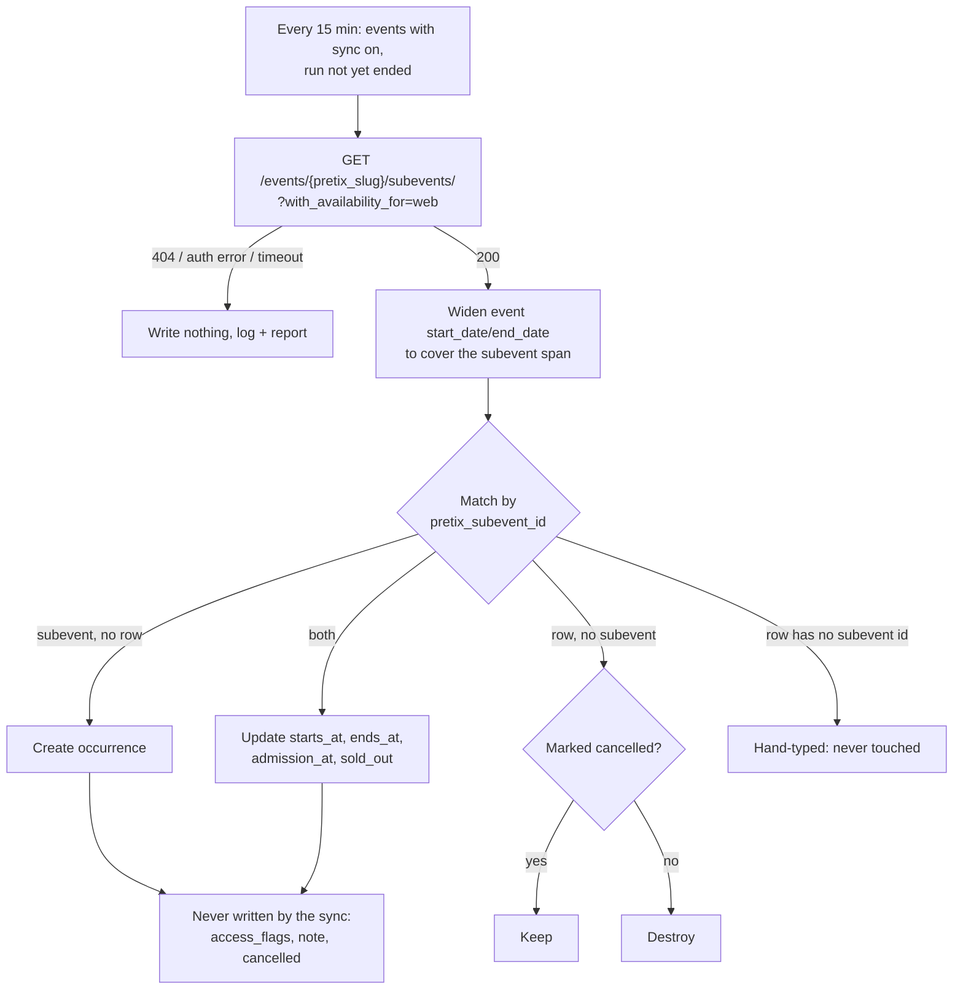

# Syncing performances from pretix

**Date:** 2026-08-31
**Status:** Design approved, implementation pending

## The problem

A producer enters their run dates and every performance twice: once in pretix, which
actually sells the tickets, and once in the Bedlam admin as `EventOccurrence` rows. The
second copy is the one the public site, the box office board, the sitemap and the
schema.org output all read, and it is the copy nobody remembers to update when a date
moves. The website is therefore routinely wrong about a show that the shop is right about.

Bedlam shows are already pretix **event series**: the shop page for a current show renders
a week calendar of subevents, and `Event#pretix_slug` already names the series. A pretix
subevent is a one-for-one match for an `EventOccurrence`, so the second copy can be derived
from the first instead of typed.

## What this is not

- **Not two-way.** Nothing here writes to pretix. The shop holds real orders and there is
  one organizer with no staging copy (see `Pretix::Settings.writes_enabled?`); a bug that
  edits a live series is unrecoverable in a way a bug that edits our database is not.
- **Not a replacement for hand-entered performances.** A preview, a get-in or a free
  schools matinee is not sold through pretix and must still be enterable by hand.
- **Not a price sync.** pretix's `item_price_overrides` are per ticket *item*; our
  `ticket_prices` are named bands. Out of scope.

## Decisions

### The tick box

`events.pretix_sync_performances` (boolean). When set, a recurring job keeps the event's
pretix-owned occurrences in step with its series. It is independent of `pretix_shown`,
which only controls whether the widget renders.

### pretix owns only the rows it created

Each synced occurrence stores `event_occurrences.pretix_subevent_id`. That column is the
whole ownership model:

| Row | Sync behaviour |
|-----|----------------|
| `pretix_subevent_id` set, subevent present | Update `starts_at`, `ends_at`, `admission_at`, `sold_out` |
| `pretix_subevent_id` set, subevent gone | Destroy — **unless** `cancelled`, which is kept |
| `pretix_subevent_id` set, subevent hidden (`is_public: false`) | Treated as gone |
| `pretix_subevent_id` nil, same `starts_at` as a subevent | **Adopted** — the row is taken over rather than duplicated |
| `pretix_subevent_id` nil, no matching subevent | Hand-typed. Never read, never written, never deleted |
| Subevent with no row | Create |

Adoption is what stops a producer who typed their dates in *before* ticking the box getting every
night twice. Same curtain time means same performance, so the existing row is taken over and keeps
the flags and note already on it. A row at a different time is deliberately not merged: that is a
matinee, a preview, or a genuine disagreement about the curtain time, and none of those are the
sync's to resolve.

`access_flags`, `note` and `cancelled` are producer-owned and are **never** written by the
sync, on create or on update. That is what makes "tick the box and still tag the relaxed
night" work: the sync only ever touches the four fields pretix is authoritative for.

### Cancelled is a human statement, not an inference

pretix has no cancellation concept for a date. It has `active` ("shop available") and
`is_public` ("shown in lists"), and *not yet on sale* is indistinguishable from *pulled*.
A wrong "CANCELLED" on a public page is worse than saying nothing, so
`event_occurrences.cancelled` is set only by a person in the admin and is never written by
the sync.

This is also why a cancelled row survives its subevent disappearing: deleting it would
erase a statement a producer deliberately made to the public. It keeps its
`pretix_subevent_id`, so if the date returns to pretix the row reattaches rather than
duplicating.

`active: false` subevents **are** synced — a date not on sale is still a performance.
`is_public: false` ones are not: hidden in the shop means hidden on the site.

### Sold out is read, and read conservatively

`?with_availability_for=web` adds `best_availability_state`: 100 means available, below 100
means sold out or reserved, `null` means unknown. Unknown is stored as **not** sold out —
never falsely tell someone they cannot buy a ticket:

```ruby
sold_out = state.present? && state < 100
```

### The run widens to fit

`EventOccurrence#starts_at_within_run` rejects a performance outside `start_date..end_date`,
so a pretix date beyond the run would fail to save. The sync widens the event's run to
cover the subevent span before saving occurrences, and never narrows it — a run may
legitimately be wider than its ticketed dates (a get-in, a free preview), but it can never
legitimately be narrower than a date the shop is selling.

### Doors open becomes per-occurrence

pretix carries `date_admission` per date; we have only an event-wide
`doors_open_minutes_before`. A new nullable `event_occurrences.admission_at` takes it, and
`EventOccurrence#doors_open_at` prefers it, falling back to the event-wide offset. Existing
behaviour for every hand-typed and archive occurrence is unchanged.

### Cadence: one job, every 15 minutes

Dates change rarely; sold-out changes minute to minute. One job covering both, scoped to
synced events whose run has not ended, costs about one API call per on-sale show per run —
trivial against pretix's 300/min budget — and leaves one code path to reason about rather
than two.

Scheduled at `7,22,37,52 * * * *`. Not on a multiple of five: `reimbursements_mailbox_poll`
runs every five minutes and owns every such minute (see `recurring_schedule_test` and the
background-jobs section of CLAUDE.md).

### A series that does not exist yet is a waiting state

pretix answers **403, never 404**, for an event slug it will not show you — it declines to leak
whether the event exists (confirmed against the live organizer: a garbage slug and a real-but-absent
one give the identical 403). So an unbuilt shop and a revoked token arrive as the same status on the
same endpoint, and `Client#events_readable?` — one organizer-level read, memoized per sync run — is
what separates them: a working token means the event is simply not in pretix yet, while a token that
can read nothing is a real outage and stays loud.

Ticking the box before building the ticket shop is the natural order to work in, so that case is
**not** a failure. It is caught, written to `events.pretix_sync_error`, and shown as a banner on
the event's admin page; nothing is raised and nothing reported. Raising would alert every such
event every fifteen minutes for the length of its run, and the producer would see a ticked box,
no dates, and nothing explaining either.

`events.pretix_synced_at` records the last good read. Both columns are written with
`update_columns`, not `update!`: this runs per event per quarter hour, and `has_paper_trail` would
otherwise file a version for every pass.

### An outage must never blank a run

An auth failure or a timeout writes **nothing** and is logged and reported; the existing
occurrences stand. Only a successful `200` may delete anything. A response that
would delete every synced occurrence for an event is carried out — an emptied series is a
real thing — but reported, because it is also what a mis-set slug looks like.

## Flow



## Components

| Unit | Responsibility |
|------|----------------|
| `Pretix::Client#subevents` | One paged read of a series' subevents, with availability. Extends the existing paced client; no new transport. |
| `Pretix::PerformanceSync` | All of the above for **one** event. Takes its client as a constructor seam, as `MembershipSync` does. Returns a result struct of counts. |
| `Pretix::SyncPerformancesJob` | Recurring. Selects the due events, calls the sync per event, isolates a per-event failure so one bad slug cannot stop the rest. |
| `EventOccurrence` | Gains `pretix_subevent_id`, `admission_at`, `sold_out`, `cancelled`, `#pretix_synced?`, and `#doors_open_at` preferring `admission_at`. |
| Admin event form | The tick box; date/time inputs read-only on synced rows; a `cancelled` checkbox; a "Sync now" button; the waiting banner on the event's show page. |
| `Pretix::PerformanceSyncEnablement` | Bulk switch-on across future events, behind `pretix:enable_performance_sync`. No probe — adoption and the waiting state make one unnecessary. |
| Show page + `SchemaHelper` | Renders the sold-out and cancelled badges; emits `availability: SoldOut` and `eventStatus: EventCancelled`. |

## Surfaces

Agreed: the **show page performance list** (badges beside the dated list, alongside the
existing `Event::Schedule#exceptions` line) and **schema.org structured data**. The box
office board is deliberately unchanged — its layout is measured in pixels and a badge there
needs its own design pass.

## Testing

- `Pretix::PerformanceSync` unit tests against a fake client (a plain object; this suite has
  no mocking library) covering each row of the ownership table, the widening, the
  conservative sold-out reading, and the outage case writing nothing.
- Job test: one failing event does not stop the others.
- `recurring_schedule_test` already enforces the schedule rules.
- Functional test for the admin toggle and "Sync now".
- Schema.org assertions for `SoldOut` and `EventCancelled`.
