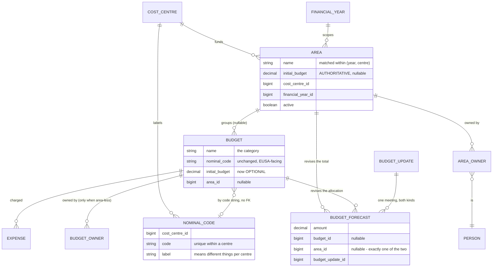

# Areas: grouping a show's spend across nominal codes

**Status:** design, awaiting review. Decision and its evidence: [plans/area-grouping-options.md](../../../plans/area-grouping-options.md).
**Decided:** Option D — an `Area` above budgets, with a budget line found-or-created on demand.

## The problem

A budget carries one nominal code and one figure, so a show that spends under more than one
heading needs more than one budget — and once it does, its spend cannot be seen together, given a
single total, or given a single owner.

Both cost centres have already invented a workaround for the missing concept, in different
shapes:

- **Fringe** puts it in the budget *name*: 17 of its 31 budgets read `Area: Category`
  (`BF Marketing: Correx Boards`, `Improverts: Retreat`, `Cogito: Marketing`). The other 14 are
  genuine standalone overheads — payroll, NI, Contingency, PRS/PPL.
- **Termtime** puts it in the *sheet*: `Semester 1 Shows`, `Committee Budgets`,
  `Subcommittee Budgets`, `Utilities` all import with a name and no amount, because they are
  section headers with their lines beneath. The importer discards that structure.

Note also that a show's `Marketing` and `Other` lines carry the **same** nominal code (`432320`
for all of Cogito, Last Orders and Improverts). The category axis is Bedlam's, is finer than
EUSA's chart of accounts, and lives only in the budget name today. Anything that replaces the
budget with a per-transaction code loses it — which is why the code stays on the budget.

## Data model

`Reimbursements::Area` — `name`, `cost_centre_id`, `financial_year_id`, `initial_budget`,
`notes`, `active`. Matched **by name within one (financial year, cost centre)**, the same rule
`BudgetImport` already uses for budgets, so an area recurs each year the way a budget does.

`Budget` gains `area_id`, nullable. A budget with no area behaves exactly as it does today — which
is what keeps the 14 standalone overheads, and every existing screen, working untouched.

**Nothing about the EUSA-facing structure moves.** The nominal code stays on the budget, so
`effective_nominal_code`, the BACS spreadsheet, the exports, and Reconcile's income match on
`budget.nominal_code` are all unchanged.

## Figures

**The area's figure is authoritative; a budget's is optional.** (Mick, 2026-09-10 — splitting an
agreed total across categories is sometimes not possible, and the schema should not demand it.)

`reimbursements_budgets.initial_budget` is *already* nullable, and the existing readers already
degrade honestly rather than lying: `projected_amount` is `current_forecast || initial_budget`,
`remaining` is nil without a forecast, and `variance` is nil if either side is nil. So "a line
with no agreed figure" needs no new handling — it needs the screens to stop implying one.

On the area:

| reader | meaning |
|---|---|
| `initial_budget` | the agreed total for the show. Nullable — the 7 backfilled areas start without one. |
| `committed_amount` | sum of its budgets' committed (Approved + Submitted + Paid, ex-VAT) |
| `remaining` | `initial_budget - committed_amount`, nil when there is no agreed total |
| `allocated` | sum of its budgets' `initial_budget`, skipping the nil ones |
| `unallocated` | `initial_budget - allocated` — how much of the total has not been split out |

`allocated` vs `initial_budget` is the drift worth showing: it says how much of the show's budget
has been assigned to categories, without pretending the remainder is spare.

**Expense and Income areas are never totalled together**, for the same reason budgets aren't
(`NominalCodeRollup#by_type`). An area holding both is an error worth reporting at import.

## Ownership

**The area owns; its budgets inherit.** `Budget#owners` resolves to `area.owners` when the budget
has an area, and to its own `budget_owners` rows when it doesn't.

- New join `reimbursements_area_owners` (`area_id`, `person_id`, unique together), mirroring
  `reimbursements_budget_owners` exactly.
- `Reimbursements::OwnerReview` needs no change *if* `Budget#owner_ids` keeps its current
  contract (Person record-id strings). Resolve inside the model, not at every call site.
- **The backfill must seed each area's owners from the union of its children's**, or the seven
  new areas would own nothing and every claim under them would skip the owner gate silently. Few
  owners exist today (the 2026-07 UX review counted 26 of 31 budgets with none), so this is small
  — but "the gate quietly stopped applying" is the worst way to get it wrong.
- `budget_owners` rows on an area-bound budget are **kept, not deleted** — they are the record of
  who owned it before, and deleting them makes the backfill irreversible.

## Where areas come from

**An explicit `Area` column in the committee's spreadsheet** (Mick's choice over reading the
header rows). Matched by name within (year, cost centre); created when absent, exactly as budget
lines are.

- An optional **`Area Budget`** column supplies the area's authoritative total. Because a sheet
  has one row per budget line, that value repeats down the rows of an area — **two different
  values for one area is a blocking error**, not a last-one-wins. Consistent with the importer's
  existing rule that an unreadable amount blocks the import.
- `initial_budget` on an area is **write-once on create**, like a budget's, so a re-import logs a
  revision rather than rewriting the figure the committee agreed. See the open question below on
  where that revision is recorded.
### Managing areas by hand (v1)

The sheet is the normal route, but not the only one — the seven backfilled areas exist before any
sheet has an `Area` column, and a mis-filed line should not need a re-import to correct.

- **The area's edit form carries its budgets as nested fields**
  (`accepts_nested_attributes_for :budgets`, rendered through `shared/form/sections/_nested_fields`
  — and unlike `ticket_prices`, these are a real association, so no `template_object:` is needed).
  Add a line to an area, edit its name/code/figure, and detach one, all in one form.
- **A budget's own edit form gains an area picker**, so a line can be moved from the other
  direction. Both routes write the same `area_id`.
- Detaching a budget sets `area_id` to nil; it does not delete anything. A budget with no area
  behaves as it does today.

**A hand move is NOT silently reverted by the next import.** When the sheet's `Area` column
disagrees with a budget's current area, the import reports it as a **re-home** in the preview —
its own bucket, ticked by default, alongside create/revise/unchanged — rather than applying it
silently. This follows the importer's existing temperament: `absent_budgets` are reported and
never deleted, and an unplaced line is adopted rather than quietly shared. Somebody moved that
budget on purpose, and the sheet should have to say so out loud before undoing it.

## Find-or-create, and the nominal code list

A submitter picks their **area**, then a **category**. The category list is the area's existing
budgets, plus "another category…" which offers that cost centre's nominal codes by label. Picking
one creates `Budget(area:, nominal_code:, name: <label>, initial_budget: nil)` — a line with no
agreed figure, which reads on every screen as *unbudgeted spend within this area*.

`Reimbursements::NominalCode` — `cost_centre_id`, `code`, `label`, `active`; unique on
`(cost_centre_id, code)`. **Per centre, because the same code means different things in
different pots** (Mick, 2026-09-10). Seeded from the codes already in use per centre, labelled
from the budget names that carry them.

**Maintained on the cost centre's own edit page** (Mick, 2026-09-10) — `SettingsController`,
which is already the CostCentre CRUD under another name, and already the place its mailboxes,
EUSA code and nightly run-days live. Nested fields beside those, the same vocabulary as the area
form. **The list is owned by that centre's finance admin**, which is the answer to "who keeps it
current": the person who owns the pot owns its chart of accounts, and it sits on the page they
already visit to configure the centre.

Rules:

- **Creation is inside the same transaction as the claim**, and re-takes the find under a lock —
  the same hazard `DatabaseStore#create_expense_for_actual!` already guards, where a
  double-submitted form would otherwise create the line twice.
- A budget created this way is **flagged for finance** on the Review queue until someone with the
  finance permission has seen it. The claim is never held up; the line does not pass unseen.
- The producer picker still reads `active_budgets`' rules — an area whose cost centre is not the
  active year's is not offerable.

## Backfill

One migration, reversible, run per cost centre:

1. For each budget whose name matches `/\A(?<area>[^:]+):\s*(?<category>.+)\z/`, take the area
   name (stripped — `"Improverts:  Retreat"` has two spaces) and find-or-create the `Area` within
   that budget's (year, centre).
2. Point the budget at it. **Leave the budget's name alone** — renaming `Cogito: Marketing` to
   `Marketing` is a second, cosmetic change and would rewrite every screen's labels in the same
   step as the structural one. Do it later, or never.
3. Seed each area's owners from the union of its children's `budget_owners`.
4. Areas get no `initial_budget` — nobody agreed one.

Expected on today's data: **7 areas over 17 of Fringe's 31 budgets**; the other 14 stay area-less.
Termtime's 62 have no colon convention and get nothing until their sheet carries an `Area` column.

Down-migration drops `area_id`, the areas and the area owners; the `budget_owners` rows kept in
step 3 are what make that a true reverse.

## Screens and store readers

| surface | change |
|---|---|
| Budgets index | group rows under their area; area subtotal row; area-less budgets in their own section |
| Budgets overview | `NominalCodeRollup` unchanged (still by code). Add an area rollup beside it — the same `by_type` re-group mechanism |
| Budget new/edit | area picker; area figure and owners move to the area's own form |
| Producer submission | area → category picker, with "another category…" |
| Review | show the claim's area beside its budget; flag finance-unseen lines |
| Exports | an `Area` column in `Exports::Budgets` and `Exports::Expenses`, appended (a saved formula keeps pointing at the same column) |
| `DatabaseStore` | `areas`, `areas_for_year`, `areas_with_actuals`; `budgets*` readers gain `includes(:area)` |

**Scoping follows the rules already stated in CLAUDE.md**: `areas_for_year` is year- and
cost-centre scoped; anything that is an id→record lookup is not; nothing on the money path reads
a lenient filter.

## Testing

- Backfill: a budget with a colon, one without, one with a double space, one already in an area,
  and the owner-union step. Run the down-migration and assert the tree is gone and the
  `budget_owners` rows still stand.
- Ownership resolution: a budget in an area (inherits), one not (its own), and an area with no
  owners (gate does not apply) — asserted through `OwnerReview`, not just the model.
- Find-or-create: concurrent double submit creates one line, not two.
- Import: `Area` column creates and matches; two different `Area Budget` values for one area
  block the import; an area holding both Expense and Income budgets is reported.
- Figures: an area with no total, a line with no total, and drift between `allocated` and
  `initial_budget`.
- **A system test that clicks the real submit on the area→category picker**, per the two defects
  on 2026-09-10 that request-level tests could not see.

## Open questions for review

1. ~~Where is a revision to an area's total recorded?~~ **RESOLVED: a forecast attaches to
   either.** `budget_forecasts.budget_id` becomes nullable, `area_id` is added, and a check
   constraint requires exactly one of the two. `BudgetUpdate` is unchanged and groups both kinds,
   so one committee meeting stays one update.

   Mick asked whether forecasts should simply *become* area forecasts. They can't, and the
   production data is why: **14 of Fringe's 31 budgets have no area** — Hourly payroll, NI
   contributions, Consumables, PRS/PPL, Contingency — and they need revising like any other line.
   Contingency is the proof: it is the one budget Maysan's 2026-09-08 import revised. A
   pure area-level forecast log could only express that by inventing a single-child area for each
   of those 14 overheads, which is a fake grouping created to satisfy a table.

   The alternative of a parallel `area_forecasts` table was rejected for two reasons: `jscpd`
   gates duplication at 0 and the model would be a near-copy, and more importantly two forecast
   concepts drift — the day one gains a `reason` or an effective-date rule, the other won't.

   Both levels having a revision log is meaningful rather than redundant: an **area** forecast
   revises the show's agreed total, a **budget** forecast revises how much of it a category is
   allocated. `Budget#variance` keeps its current meaning untouched.
2. **Should the backfill rename `Cogito: Marketing` to `Marketing`?** Left out above
   deliberately. It is what makes the grouping read well, and it is also a rewrite of every
   label in the same migration as the structural change.
3. ~~Who owns the nominal code list?~~ **RESOLVED: the cost centre's finance admin, maintained
   on the cost centre edit page** (Mick, 2026-09-10). See the section above.

4. **Does the area's `Area Budget` column belong in the sheet at all**, now that areas are
   hand-editable? Setting an authoritative total in two places (a repeated spreadsheet column and
   the area form) is the kind of split that goes stale. The alternative is that the sheet names
   areas and the totals are set in the portal. Not blocking — the import can ship without the
   column and gain it later.

## Out of scope

- Linking an area to the main app's `Event`. There is currently zero linkage between the
  reimbursements module and the show domain, in either direction. An area is the natural place a
  future `belongs_to :event` would hang — do not design it in a way that forecloses that, but do
  not build it.
- Renaming budgets (see open question 2).
- Areas spanning cost centres or financial years. A show is funded from one pot in one year.
