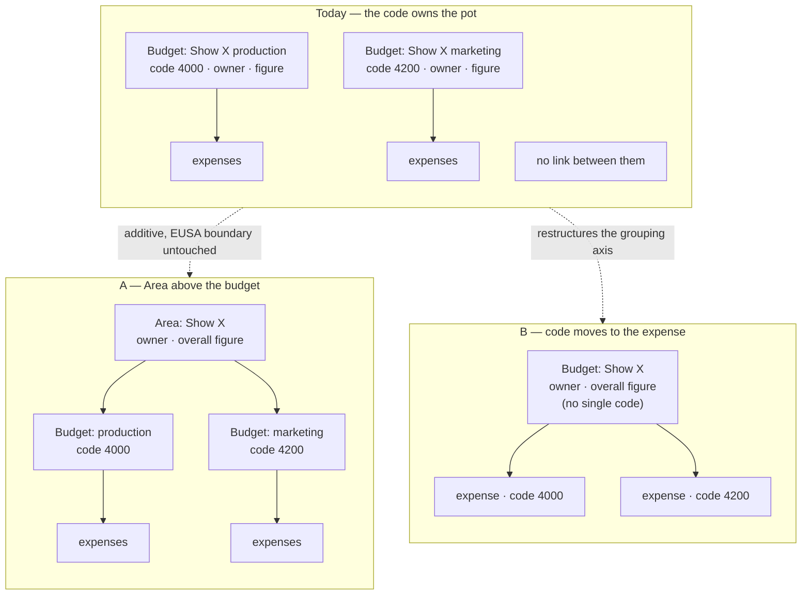

# Grouping a show's spend across nominal codes — options

**Status: DECIDED — Option D** (Mick, 2026-09-10). Written against `157624fa`; needs a spec next.

The decision turned on production data rather than on the models. Mick initially chose B, on the
grounds that A/D's budget sprawl was not worth it and that rewrite cost is no constraint while the
portal is still being prototyped — both fair. Two facts from the live database changed it:

1. **The sprawl already exists, and the grouping is already in the names.** 17 of Fringe's 31
   budgets are named `Area: Category` — BF Marketing (4 lines), Improverts (3), Cogito (2),
   Last Orders (2), Venue (2), Tech (2), Utilities (2). The other 14 are genuine standalone
   overheads (payroll, NI, Contingency, Consumables, PRS/PPL). D adds a record for the prefix
   that is already there; it does not create rows. Termtime encodes the same concept differently
   — "Semester 1 Shows", "Committee Budgets", "Subcommittee Budgets", "Utilities", "Extras That
   Are Weird" all import with no amount, because they are section headers with their lines
   beneath. Two cost centres, two hand-rolled conventions, both working around the same missing
   concept.
2. **B would have lost a distinction the current structure carries.** For all three shows,
   `X: Marketing` and `X: Other` carry the SAME nominal code (`432320`). The Marketing/Other
   split is not encoded in the nominal code at all — it lives in the budget name. So "one budget
   per show, code on the transaction" has nothing left for that axis to live on, unless the
   expense gains a category field beside its code, at which point the category is doing the
   Area's job per-transaction.

**Backfill is close to free:** split the budget name on the colon (stripping whitespace —
`"Improverts:  Retreat"` has two spaces) and 17 of 31 budgets sort themselves into 7 areas with
no human judgement. The 14 without a colon stay area-less, correctly.

## The problem, precisely

A budget carries exactly one `nominal_code` (`reimbursements_budgets.nominal_code`, a plain
string). A show's spend does not: production costs and marketing sit under different codes. So a
show needs two or more budgets, and once it does, three things become impossible:

1. **See all of a show's expenses in one place.** Every list is per budget.
2. **Give the show one overall figure.** `initial_budget`, `current_forecast`, `remaining`,
   `variance` and `expected_outturn` are all computed per budget (`budget.rb:87-181`); nothing
   sums across a set of them except the nominal-code rollup, which groups by *code*, i.e. exactly
   the wrong axis.
3. **Give the show one owner.** Owners hang off the budget (`reimbursements_budget_owners`), so
   the same person has to be attached to each budget separately, and the sign-off gate
   (`OwnerReview`) reasons per claim per budget.

## What cannot move

The nominal code and the cost centre are **EUSA's** structure, not ours. They are what the BACS
spreadsheet carries (`effective_nominal_code`, `bacs_xlsx.rb:108`), what EUSA's monthly actuals
export is keyed by (`reimbursements_eusa_actuals.nominal_code`), and what Reconcile matches income
credits on (`reconciliation.rb:183-186`). A "show" is a Bedlam concept EUSA has never heard of.

Any option that disturbs the code/centre pair pays for it at the EUSA boundary. Any option that
adds a Bedlam-side grouping *beside* that pair does not.

Two facts that shape the answer:

- **The expense already has its own code column.** `reimbursements_expenses.nominal_code_override`
  exists today, and `effective_nominal_code = override.presence || budget.nominal_code`
  (`effective_payee.rb:54-56`) is what the money path already reads. Option B is less of a leap
  than it looks.
- **Rollups are deliberately linkage-based, not code-based.** `unattributed_actuals`
  (`database_store.rb:138-157`) rejects rows by linkage precisely *because* several budgets share
  one code. Any option must keep actuals attributable.

## The three shapes

### Option A — an `Area` (or `Project`) record above budgets

`Reimbursements::Area`: name, cost centre, financial year, owners, an overall figure.
`Budget belongs_to :area, optional: true`. Budgets keep their nominal code and everything else.

**Gives you** all three: one owner at the area, one overall figure at the area, and "all expenses
for this show" as `area.budgets.flat_map(&:expenses)`.

**Costs**

- One new table, one nullable FK, one optional column on the budget import sheet.
- Rollups gain a second grouping axis. `NominalCodeRollup` already demonstrates the mechanism —
  `by_type` (`nominal_code_rollup.rb:34-39`) re-groups the same struct over a subset — so an
  `by_area` is the same move, not new machinery.
- Two rules to decide and state once (see open questions).

**Breaks** nothing. Reconcile, the BACS path, every export and the whole EUSA boundary are
untouched, because the code/centre pair is exactly where it was. Existing budgets get a null area
and behave as they do today, so it can ship dark and be populated gradually.

### Option B — the nominal code moves onto the expense

Budget stops being code-tied and becomes the show. Each expense carries its own code (keeping
`budget.nominal_code` as the default the expense inherits, so nothing has to be backfilled by
hand).

**Gives you** all three with no new table, and it is arguably the more honest model — a nominal
code classifies a *transaction*, not a pot.

**Costs**

- Somebody must set the code per expense. Today nobody ever does; `nominal_code_override` is a
  finance escape hatch, not a routine field. That is a new obligation on every claim, and getting
  it wrong is wrong money on the BACS file.
- `budgets_by_nominal_code` (`database_store.rb:134-137`) and the whole overview move from
  budget-level to expense-level grouping — a real rewrite of the screen finance actually uses.
- Reconcile's income-credit→budget match by code (`reconciliation.rb:183-186`) loses its key and
  needs rethinking.
- The `?cost_centre=`/nominal-code prefill on the actuals→expense conversion
  (`actuals_controller.rb:189-193`) needs the same.

**Breaks** the EUSA-facing grouping and has to rebuild it from the expense side. Doable at this
scale (~31 budgets, ~300 actuals a year), but it is the option with real risk in it.

### Option C — a group label on the budget

A `project` string (or a small `BudgetGroup` row) on the budget, plus "group by project" on the
index and overview.

**Gives you** one of the three: you can see a show's spend together. It gives you no overall
figure and no single owner — those stay per budget, and the label is a reporting convenience.

**Costs** almost nothing; a day, and reversible.

### Option D — Area, with budgets found-or-created (added after Mick's 2026-09-10 note)

Option A's data model, without Option A's setup burden. `Budget` stays the (area, nominal code)
pair; what changes is that nobody has to pre-create one. A submitter picks their **show**, then a
category:

- the area already has a budget for that category → the claim goes there, as today;
- it doesn't → the portal creates one **with no `initial_budget`**, and it renders as *unbudgeted
  spend within the area*. That is information, not a gap: it says this show spent against a
  category the committee never budgeted for. The business manager can attach a figure later, or
  leave it.

The committee's spreadsheet still creates the budgets it knows about, with their agreed figures,
through the importer that already exists. `initial_budget`-is-write-once already gives the right
semantics for a line that gets budgeted after the fact.

**What it costs:** the per-cost-centre code list below, because a category the area does not yet
have must be nameable from somewhere.

**What it doesn't cost:** nobody checks a nominal code per transaction (B's burden), and nobody
pre-creates a budget per (show × code) (A's burden).

## The labour trade is the real axis

Mick's framing, and it is sharper than the data-model comparison:

| | who does the work | when | bulk-able? |
|---|---|---|---|
| **A** | business manager creates a budget per (show × code) | once per show, at budget time | **yes** — the spreadsheet import already does it |
| **B** | business manager checks the code on every transaction | every claim, forever | no |
| **D** | nobody, in the common case | — | n/a |

A's cost is front-loaded and importable. B's is per-claim and cannot be batched. That asymmetry,
not the elegance of the model, is what should decide this.

## Nominal codes mean different things in different cost centres

Also Mick's, and it is a cost that lands almost entirely on B.

**Today a nominal code is never rendered with a label** — it appears as a bare number everywhere
(`budgets/index.html.erb:55` shows `name · code`; Reconcile and the EUSA email print the code
alone). So the human label for a code *is the budget's name*, and because a budget belongs to a
cost centre, per-centre labelling already exists at no cost.

- **A and D keep that**: the budget name is the label, already scoped.
- **B loses it**: once the code lives on the expense, it needs its own lookup — and it cannot be
  `code → label`, it must be **`(cost_centre, code) → label`**, the same code carrying different
  names in different centres. That table has to exist and be maintained before anyone can pick
  from a dropdown.

D needs that table too, but only for the "category this area hasn't used yet" case, and a wrong
pick there creates a visibly unbudgeted line rather than a mis-coded payment.

## Recommendation

**Option D** — which is Option A's data model, so the diagram above still describes it; what D
adds is that the portal creates the (area, code) budget instead of the business manager.

The grouping people want is a Bedlam concept, and A/D add it as a Bedlam-side layer without
touching the EUSA-facing structure the BACS file, the exports and Reconcile all depend on. Both
ship dark and leave every existing budget behaving exactly as it does. D is the one to build
because the only serious objection to A — that somebody has to create a budget line for every
category a show turns out to spend on — is answered by creating it on demand, and the line it
creates carries a true statement (this was not budgeted for) rather than a guess.

Option B is the better model in the abstract and I would not argue against it in a greenfield
portal. But it buys its elegance three times over: per-expense coding becomes mandatory when
nobody does it today, it needs a `(cost_centre, code) → label` table built and maintained before
the dropdown can exist, and it puts a per-transaction check on the business manager that cannot be
batched. That is a lot to take on for a structure whose current pain is "the overview has two rows
where I want one".

Option C is worth naming only as the fallback if the appetite is small: it delivers the visibility
and none of the control.

**If D's find-or-create feels too magic**, A is the honest fallback and nothing is wasted — D is A
plus one lookup, so building A first and adding find-or-create later is a clean order.

**A door worth leaving open, not walking through now:** there is currently *zero* linkage between
the reimbursements module and the main app's `Event`/show domain — grepped in both directions,
nothing. An `Area` is the natural place a future `belongs_to :event` would hang, which would
eventually let a show's own page state its spend. Not in scope; just don't design the Area in a
way that forecloses it.

## Open questions before this could be specced

1. **Is the area's figure authoritative, or derived?** Either the area holds the agreed total and
   the child budgets are allocations within it (so they should sum to it, and a mismatch is worth
   showing), or the area's total is just the sum of its children and the "overall budget" is a
   display. The first is more useful and needs a variance rule; the second is free.
2. **Where does ownership live when both have owners?** Cleanest: the area owns, and a budget with
   an area inherits its owners, so `OwnerReview` keeps working unchanged by resolving through the
   area. Alternative — both can hold owners and the sets union — is more flexible and harder to
   reason about at sign-off time.
3. **How does an area get created?** By hand only, or as a column in the committee's budget
   spreadsheet? The importer matches lines by name within (year, cost centre); an Area column
   would match the same way, and `initial_budget`-is-write-once already gives the precedent for
   how a re-import should treat it.
4. **Does an area belong to one cost centre?** Almost certainly yes (a show is funded from one
   pot), which makes it a clean child of the cost-centre scoping work.
5. **Under D, who may bring a new budget line into being by claiming against it?** Any submitter
   (fewest blocks, but a producer's mis-pick creates a row) or finance only (safer, but it is the
   very approval step D exists to remove)? A middle reading: any submitter may, and the new line
   is flagged on the Review queue until someone with the finance permission has looked at it —
   the claim is never held up, but the line does not pass unseen.
6. **Where does the `(cost_centre, code, label)` list come from, and who keeps it current?**
   EUSA's chart of accounts is the source, but nothing in this repo has ever held it. Seeded once
   from the codes already in use (`Budget.distinct.pluck(:nominal_code)` per centre, labelled from
   the budget names) is the cheap start, but it needs an owner or it rots — and a rotted list is
   worse than no list, because it silently steers spend to a dead code.
