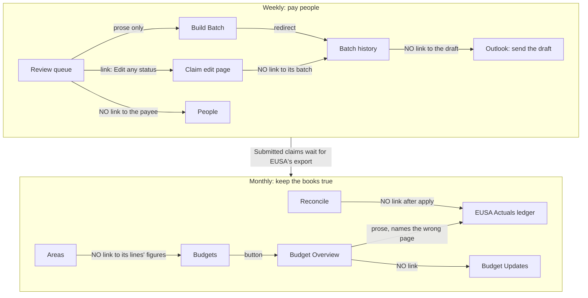

# Finance portal: can the business manager do their job?

Audit of 2026-09-21. Nineteen tasks a business manager has to do in `/admin/reimbursements`,
ranked by how often they come up, each scored for two people: someone in their **first week with
no handover** (NEW) and someone who **does this weekly and is in a hurry** (EXP). 5 is obvious
and quick, 3 is doable with friction, 1 is impossible unless somebody tells you how.

Method: four agents read the views, controllers and helpers task by task; two more then walked
the real app in a browser against seeded data (49 claims, 39 budgets in 8 areas, two cost
centres, 35 ledger rows) to confirm or refute what the code read claimed. A finding marked
**[seen]** was reproduced in the browser, **[code]** comes from the code read only, and
**[refuted]** is a code-read claim the browser disproved.

All 19 tasks were walked. Of 51 code-read claims checked in the browser, 47 were confirmed, 3
partly and 1 refuted, and the walks found 20 problems no code read saw. Where a walker's score
differed from the code read's, the scoreboard uses the walker's. The seed data is still in the
dev database, tagged `AUDIT` (people `@audit.example`, claims `[AUDIT]`, ledger refs `AUDIT-A…`);
the walkers' own mutations are there too.

## The short version

The individual screens are better than the portal feels. Nearly every page opens with a
plain-English paragraph, blocked and advisory reasons are separated on the claim itself, confirm
dialogs say what they will do, and the import wizards narrate themselves. What is broken is
everything *between* the screens:

1. **The hand-offs are sentences, not links.** "Ready to submit on the Build Batch page", "Approve
   some on the Review queue first", "Link each row on the Reconcile page" (which is also the wrong
   page). The weekly loop crosses four screens and none of them links to the next.
2. **Nothing shows what happened.** A claim has no timeline and never names its batch. Rejection
   reasons and override notes are stored and shown nowhere. History promises an EUSA draft link
   that does not exist. A budget update cannot be opened. For a job that changes hands every year,
   the portal keeps no memory a successor can read.
3. **You lose your place.** Every Review action reloads an unpaginated queue at the top. Edit's
   Save and Cancel never return you where you came from. A year or cost centre picked on one
   screen is dropped by the next sidebar click.
4. **There is no front door.** `/admin/reimbursements` sends a finance user to their own My Claims.
   Fifteen flat sidebar links put the four weekly ones at positions 1, 2, 9 and 10. No glossary,
   no dashboard tile, no "this week" view.
5. **Some screens say things that are not true.** A batch whose draft is still sitting unsent
   is headed "Sent 2026-09-21" with "Date sent" on its detail page. A card says "use the finance
   override below" with no override below. "Save changes then approve" can save, not approve,
   and blame a condition the save itself created. A Paid claim's page opens with "This can't be
   approved until these are fixed". These are small, and they cost trust in a money system.
6. **The vocabulary is never defined once.** Fifteen money labels across three budget screens,
   explained by `title=` tooltips on some screens and not others; "Current forecast" and
   "Projected" are different numbers for one idea; claim/expense, update/forecast,
   endorse/sign-off are each two or three words for one thing.

## Scoreboard

| # | Task | Tier | NEW | EXP | Worst problem |
|---|---|---|---|---|---|
| 1 | Work the approval queue | weekly | 3 | 2 | Lose your place after every action |
| 2 | Chase or override owner sign-off | weekly | 3 | 2 | No way to chase: no owner email, no remind button |
| 3 | Build batch, send EUSA draft | weekly | 2 | 3 | Draft link promised on History, never shown |
| 4 | "Where's my money?" | weekly | 2 | 3 | No claim history; search misses the submitter |
| 5 | "How much is left?" | weekly | 2 | 4 | Remaining is "-" on every un-forecast line |
| 6 | Fix a claim afterwards / reopen batch | weekly | 3 | 2 | Finance cannot change payment rail or payee |
| 7 | Reconcile EUSA actuals | monthly | 4 | 4 | Paste only; no path to the leftovers afterwards |
| 8 | Clear ledger leftovers | monthly | 2 | 3 | No "unlinked" filter; no unlink for a wrong match |
| 9 | Budget health check | monthly | 2 | 3 | Overview marks no overspend at all |
| 10 | Log forecast revisions | monthly | 3 | 3 | An update cannot be viewed or undone |
| 11 | Report to committee | monthly | 2 | 3 | Workbook is a silent download of mixed scope |
| 12 | Register payee / fix bank details | occasional | 3 | 2 | People has no search and no sort |
| 13 | Add or edit budget lines and areas | occasional | 2 | 3 | Two create routes with different fields |
| 14 | Invoice / international payment | occasional | 2 | 3 | Review card never says "Invoice"; no FX help |
| 15 | "Why didn't the email arrive?" | occasional | 2 | 2 | Status page has no send log |
| 16 | New financial year | annual | 4 | 4 | Wizard preselects the first cost centre |
| 17 | Import settled claims | annual | 2 | 4 | No sidebar entry; one grey button |
| 18 | Cost centres, nominal codes, mailboxes | annual | 2 | 3 | Curated code labels appear nowhere |
| 19 | Hand over to a successor | annual | 1 | 3 | No landing page, no glossary, no guide |

Weekly tasks average NEW 2.5 / EXP 2.7, the lowest tier, and it is the one done most. The two best-scoring tasks (7, 16) are the two wizards,
which is the pattern to copy: state the steps, name the consequence, link the next thing.

## How the work flows, and where the links are missing

## Findings by task

Severity: **B** blocker (task fails or gives a wrong answer), **M** major, **m** minor. Size of
fix: S / M / L.

### Tier 1: weekly

**1. Approval queue** (`review/index.html.erb`, `_expense_card.html.erb`)
- M/S **[seen]**: every action redirects to the bare tab URL; cards carry no `id`, the queue is
  unpaginated (`review_controller.rb:407-409`). Measured: scrolled to 1608px to approve #13, came
  back at 0. Five claims are 3,612px of page in a 711px viewport, and at 1366×768 the first
  card's Approve button is already below the fold. Give cards an id and redirect with an anchor.
- B/S **[seen, new]**: "Save Changes" in the approve dialog can save and not approve. Editing an
  endorsed claim's amount revokes the endorsement, so the claim moves to Awaiting owner and the
  only message is "#12 needs a budget owner's endorsement first", which reads as a standing
  condition. The plain Save path already has the right sentence (`review_controller.rb:74-75`);
  the save-then-decide path needs it too.
- M/S **[seen, new]**: that dialog renders at the viewport's top-left corner, over the sidebar
  logo (`position: fixed; inset: 0; margin: 0` defeats `showModal()`'s centring).
- M/S **[seen]**: the "This can't be undone" confirm fires *before* the missing-reason check, so
  you agree to something irreversible and are then told "A rejection reason is required".
- M/S **[seen]**: a rejection reason is stored and emailed, then shown nowhere
  (`rejects_expenses.rb:19`). Flashes are auto-dismissing toasts, so nothing on the page records it.
- M/M **[seen]**: no undo for a reject; nothing in the codebase returns a claim to Pending.
- M/S: blocking reasons are bare nouns ("no bank details") and nothing in the alerts is a link:
  not the payee's People row, not the budget, not the named duplicate `#41`
  (`review_support.rb:71-93`, card `:154-177`).
- m/S: reject box has no `required`; bulk toolbar's one reason box sits beside Approve selected.
- Works well, keep: save-then-approve dialog (`review_decision_controller.js`), blocked vs
  advisory inline, receipt beside the form, empty state linking to the next tab.

**2. Owner sign-off**
- B/S-M **[seen]** (chase half): owner *names* only. Zero mailto links and zero remind controls
  on the tab, no last-reminded time, no mention that a nightly reminder exists (card `:113-115`).
- B/S **[seen, new]**: a card can promise an override it doesn't have. #16 (payee with no bank
  details) said "Or use the finance override below" while the override control was suppressed;
  its only buttons were Reject and Edit.
- M/M: no bulk on this tab by design, so one absent owner gating ten claims is ten forms.
  The stated reason argues for a bulk *override*, not for nothing.
- M/S **[seen, worse]**: the override note is write-only (`review_controller.rb:116`), and once
  approved even the "Owner sign-off overridden" pill is gone: the endorsement lookup is built
  from the Pending list only. The one record that finance bypassed a control vanishes the moment
  the bypass succeeds.
- m: no "waiting since"; endorse / endorsement / sign-off are three words for one thing.

**3. Build batch**
- B/M: redirect notice says the "EUSA draft link will appear here"
  (`batches_controller.rb:81-83`). `eusa_draft_web_link` reaches only the operator email
  (`build_batch_job.rb:133`); `Batch` has no column for it and neither History nor Detail renders
  one. **[seen]** Every link on both pages was enumerated: none leads to the draft. The one
  manual step left in the flow has no button.
- B/M **[seen, new]**: History heads a batch "Sent 2026-09-21" and Detail labels the typed BACS
  date "Date sent", for a draft nobody has sent. "Producers notified: Yes" records an attempt,
  not a delivery. "Did this actually go?" cannot be answered from the portal.
- B/M **[seen, new]**: Reopen refused a batch built minutes earlier ("could not be confirmed as
  still unsent… repair reconciliation manually"). In dev that is the stub draft, but production
  looks the same whenever Graph is unreachable: no link to check the draft yourself, no attested
  override, no named tool, and the refusal arrives after the destructive-sounding confirm.
- M/S **[seen, new]**: fifteen near-identical follow-up-failure paragraphs (~5,000 characters)
  push the batch list below the fold and stay there. Collapse to a count with details.
- M/M **[seen, new]**: `Body (HTML)` is a raw-markup textarea on the money path.
- m **[seen, new]**: international rows show "-" under Bank details on the preview, the one
  screen whose job is checking; "Don't rebuild in the meantime" sits under a live Build button;
  Detail has no heading and a dangling "BACS SharePoint:" label.
- M/M: nothing records whether the draft was sent; "Draft created: Yes" is terminal. The Graph
  probe that knows exists only inside Reopen (`batches_controller.rb:163-177`).
- M/S **[seen]**: sidebar link drops the cost centre, so a two-centre portal sees the chooser
  every time, and the chooser doesn't say how many claims wait in each pot.
- M/S: Approved tab and Build Batch name each other in prose both ways.
- m/S: preview and Detail rows don't link to the claim; failure messages name claim numbers as
  text and end in "repair manually, DO NOT rebuild" with no tool; "BACS date" unexplained.

**4. Where's my money**
- B/M-L: no status history anywhere. `Expense` has no PaperTrail; submitted / endorsed / approved
  / batched / paid live on four tables and no screen assembles them. The finance edit page shows
  less than the producer's show page (`expenses/show.html.erb:23-26` has Created and Paid on).
- B/S **[seen]**: a claim never names its batch; `batch_id` is rendered in no view. A Paid
  claim's page is a status pill and nothing else.
- B/S **[seen]**: search reads the *effective* payee (`expense_edits_controller.rb:144-152`).
  `Lorcan` returns four claims and not #26, the Concord invoice he submitted; `Ines` and `Duarte`
  return nothing though she submitted #19. Search the submitter; rename the column "Paid to" and
  add "Submitted by".
- M/S-M: People has no search and no link to a person's claims.
- M/S: two sidebar items for the same records ("My Claims", "Expenses"), a third page ("Find an
  Expense") with no sidebar entry, and nothing labelled search.

**5. How much is left**
- B/S **[seen, and wider]**: `Budget#remaining` is nil without a logged forecast. On a freshly
  imported 2028/29 the Hamlet heading reads `Remaining £5,000.00` and every line under it reads
  "-". It is not only imports: a line made through New budget with Initial £450 also shows
  Remaining "-" and Variance "-". This is day one of every financial year. Fall back to initial,
  or say why it is blank.
- M/S-M **[seen]**: at 1366×768 the Budgets table overflows by 254px. Remaining just fits;
  Variance, Owners and **the Edit button are off-screen**.
- M/S **[seen]**: the header row is sticky, the area heading is not, so by the time you reach
  `Set · 439998` nothing on screen says it is Macbeth's.
- B/S-M: My Budgets shows an owner only Remaining, only when non-nil, and hides income and
  inactive lines (`my_budgets_controller.rb:28-30`). **[seen]** Its empty state names "the Budgets
  page" as plain text.
- Works well **[seen]**: the Areas index is the cleanest answer to "how much has Cogito left"
  (six columns, one Remaining), and it is the fourth sidebar item.
- M/S: "Current forecast" (index) and "Projected" (overview) are different numbers.
- M/S: Overview has no Remaining or Variance column.
- M/S: no route from an area to its lines' figures; Areas index totals include out-of-scope lines
  without the warning the other two screens give.
- m: 14 columns with Remaining and Variance last, off-screen on a laptop; Committed is ex-VAT
  while every claim screen is gross, never stated; area Remaining ignores the basis and says so
  only in a `title=` on the area edit card.

**6. Fix a claim afterwards**
- B/M **[seen]**: finance cannot change the payment rail; `payment_method` is permitted only on
  the producer's own Draft/Pending path (`expense_edits_controller.rb:169-204`).
- B/M **[seen]**: no way to change or set the payee. Claim #50 sits as "(no payee) (no email)"
  with no control that could fix it. No way to change the status either.
- M/S **[seen, new]**: an international claim with no GBP amount cannot be edited at all.
  Changing only its currency was refused with "Enter a valid amount greater than 0", naming none
  of the page's three amount fields.
- M/S **[seen, new]**: blanking the invoice amount and saving gives no error and no change; the
  field comes back as 640.0.
- M/S **[seen]**: the edit page lists "can't be approved until fixed" for every status. Paid #50
  shows "can't be approved", "worth checking before approving" and "already been paid" stacked
  (`expense_edits_controller.rb:121-123`); the index already suppresses this.
- M/S: Reopen is on History, the batch contents on Detail, and Detail has no Reopen.
- m: Save stays on the edit page, Cancel goes to the index, neither returns to Review; index has
  no cost-centre selector while Review and History do; no sort, no date range.

### Tier 2: monthly

**7. Reconcile.** Best-explained screen in the portal. **[seen]** Walked end to end with a
15-row paste, one pair unticked; every finding below confirmed.
- M/M: paste only. The shared partial is called without `file_name:`
  (`reconcile/show.html.erb:26-35`); both import wizards take .xlsx.
- M/S: never says where the export comes from, from whom, or how often.
- M/S: the apply screen's only action is "Reconcile another month"; "Unmatched rows saved: 14" is
  a to-do list with no link to where you do it.
- m: steps numbered 1 then 3; evidence score `n/8` hover-only; a failed apply loses the paste;
  the result has no URL of its own, so it cannot be reloaded or bookmarked.
- M/S **[seen, new]**: the EUSA period is stored verbatim from the sheet, so the ledger's period
  filter offers `05 / 06 / 5 / 6`. `?period=6` returned 12 rows and `?period=06` five. Someone
  asking for September gets two thirds of it and nothing says so. Normalise on import.

**8. EUSA Actuals ledger**
- B/M **[seen]**: filters are period and show-offsets only. No "unlinked", no search, 50 per
  page; 17 of the 50 rows on screen were already linked and inert.
- B/S: "Not offsetting" is reachable only after ticking "Show offsetting rows"; the hidden-count
  sentence should be the link.
- B/M **[seen]**: a row linked to a claim or a budget has no action at all (16 of 17 linked rows
  had an empty action cell). `BOX OFFICE SETTLEMENT - COGITO £1,340`, which Reconcile attached
  whole to one income line, offers nothing, so "Split across budgets" never appears on the row
  it was built for. The undo is also one-way: after "Not offsetting" nothing re-pairs the rows.
- M/M **[seen, new]**: "Link to claim" is an unfiltered radio list of every claim in the portal,
  37 of them, **including Draft and Rejected**, ordered by amount only. The row narrative said
  "BACS PAYMENT KIRSTY TOLMIE"; her claim ranked sixth, a Rejected one third.
- M/S **[seen, new]**: "Create expense" lists all 34 budgets alphabetically and ignores the row's
  nominal code, the strongest hint on the row. Eight budgets sit on 439999.
- m **[seen, new]**: a reversal credit on an expense code is offered "Split across budgets",
  whose picker holds only income lines; that picker also offers a draft year's line, unlabelled.
- M: Budget badge is not a link while the Expense badge is. **[partly refuted]** the intro does
  link to Reconcile ("Imports happen on the Reconcile page"); only the reverse link is missing.
- m **[seen]**: split form renders five rows and no "add row", so five budgets is the ceiling.

**9. Budget Overview**
- B/S **[seen]**: the health-check screen has no health signals: zero red elements, zero "Over
  budget" badges, no Remaining. `Macbeth: Set` shows committed £1,558.34 against projected
  £545.42 in plain black while the Budgets index badges the same line red.
- B/S **[seen]**: the unattributed card says "Link each row on the Reconcile page". Reconcile has
  no per-row linking; that lives on EUSA Actuals. Plain text, and its 21 rows carry no link or
  action. Its total, the one real health number on the page, sits under ~120 table rows.
- M: that card ignores the selected year while the tables above honour it.
- m: area headings aren't links; no CSV; Pipeline and Committed defined only on budget edit.

**10. Budget Updates**
- M/M **[seen]**: routes are index/new/create only. The log row has no links and no amounts, so
  you cannot see what you just typed; a meeting's worth of revisions is undone one forecast at a
  time, from each budget's edit page.
- M/M **[seen]**: the form is 36 budgets in one flat list, 2,659px tall, no area groups, no
  filter, bare names from both cost centres mixed; "New budget update" drops `?year=`.
- M: no cost-centre selector though the data is centre-scoped; rows don't name their centre.
- m: called "Budget forecasts" on the budget edit page, unlinked both ways.

**11. Reporting**
- M/M: "Export Workbook" is a sidebar link that downloads a file. No page, no sheet list, no scope.
- M/M **[seen]**: scope is mixed inside the file: Budgets follows the active year (41 rows, no
  2028/29 lines), Expenses, Actuals, People and Batches are all history, and nothing in the file
  says so. No cover sheet.
- M/M **[seen, new]**: no Areas sheet and no forecast-revisions sheet. Agreed totals, bases,
  owners and forecast history cannot be exported in any format.
- M/M: no CSV on Budget Overview or Budget Updates, the two screens a committee report wants.
- Works well: per-view "Download CSV" carries the on-screen filters.

### Tier 3: occasional

**12. People**
- B/S **[seen]**: no search, no sort; insertion order, 50 a page. A newly registered person lands
  at the bottom.
- M/S **[seen, new]**: saving bank details collapses the row and scrolls to the top, so "Mark as
  verified", the obvious next click, means finding and reopening the person again. Rows give no
  sign that they expand.
- The real weekly route into this screen is a Review card saying "Fix the override or the People
  record" as plain text. The walker left Review, found Greta by eye, fixed her, and went back
  from memory: four navigations for one missing link.
- M: six badges, no legend, "Outside spec" never explained; no links in or out of a person.
- Works well: the register form explains why it collects no bank details.

**13. Areas and budget lines**
- M/M **[seen]**: a line added on the area form gets a name and a code only. It landed as a
  visible Expense line with Initial "-" and `Expected outturn £0.00`, and the area's "Allocated"
  did not move. New budget has the full form.
- M/S **[seen, new]**: New budget accepts an area from one cost centre and a different cost
  centre, silently. The line then shows under that area's heading in the other centre's view.
- M/M: budgets index unpaginated and unsearchable.
- M/M: nominal code is free text, not a picker from the curated list.
- m/S: `budgets/edit.html.erb:1,6` drop `year:` from Back and Cancel.

**14. Invoice / international**
- M/S **[seen]**: the Review card has no type badge. Invoice #26 renders exactly like a
  reimbursement. The word "Invoice:" is hard-coded on the *international* branch only, where an
  international reimbursement would wear it too.
- M/M: no help converting to GBP and no ballpark check on what is typed.
- m/S **[partly]**: "no EUR amount" and its flash are hard-coded (`review_support.rb:111`,
  `review_controller.rb:256-258`) but currently unreachable: the card is currency-correct for a
  USD claim, and the edit form won't let the invoice amount be blanked.
- m/S: the international card omits the IBAN badge the helper already supports.

**15. Integration Status**
- B/M **[seen]**: no send log, no counts, no owner-reminder failures, no "outbound is off"
  indicator. "Did Cerys get her reminder last night?" has no answer anywhere in the portal. A
  month-stale run date renders exactly like a healthy one.
- M/S **[seen, new]**: a code comment is on screen: "#run_checks stays an array so adding the
  next one is a one-line change, and each probe is rescued on its own".
- M/S: help text omits the owner reminder; "Change it under Settings" is not a link.

### Tier 4: annual

**16. New financial year.** The model flow. One real hazard:
- M/S: arriving without a cost centre, the wizard preselects `selectable_cost_centres.first`
  (`budget_imports/show.html.erb:62-63`). Everywhere else "none" means "all" as a stated safety
  rule. A whole committee sheet into the wrong pot is a large quiet mistake. **[seen, worse]**
  The budget preview never names the centre at all (the expense preview's heading does).
- M/S **[seen, new]**: the preview never states the `Area total` it is about to set, the one
  figure that caps a whole show.
- m **[seen]**: "Columns read from your sheet (check these before importing)" is collapsed; the
  draft year's list row offers Make active but not Import budgets; the template is a CSV with a
  row of column descriptions and no word on whether to delete it.
- M/S **[seen]**: the Finance sidebar category collapses inside both wizards
  (`sidebar_component.rb:26-34` matches on path prefix).
- **[refuted]** the wizard's escape links no longer break under Turbo; all of them worked.

**17. Expense import.** Excellent once found. **[seen]**
- M/S: no sidebar entry; about four blind clicks to find it behind a grey button on "Expenses".
- M/S: same first-centre default (the preview heading does name it here).
- M/S **[seen, new]**: the docs and the validation disagree. The intro lists the required columns
  and the template calls Payment reference optional; an Approved row was refused with "Payment
  reference must not be blank." Say which statuses need it.

**18. Settings**
- M/M: the curated nominal-code labels are rendered nowhere else. Overview prints bare digits.
- B/S **[seen, new]**: Fringe's Settings page cannot be saved. Its notification email is blank
  and `required`, so the browser blocks the submit with "Please fill out this field." and no app
  message. **Check production**: if a live centre has a blank address, nobody can edit it.
- M/S **[seen, new]**: nine buttons on the page say "Save" (19 submits in all). The walker saved
  a nominal code while aiming at the centre form. Label the row button "Save label".
- m/S **[partly]**: the empty nominal-code state opens with
  `bin/rails reimbursements:nominal_code_seed`, though it does end "or add them below".
- Works well **[seen]**: the nominal-codes section itself. Retire vs Delete wording, the confirm,
  the toast, the half-typed form above left alone.
- M/M: a wall of PowerShell for IT dominates the routine controls; give it its own page.

**19. Handover**
- B/M **[seen]**: `/admin/reimbursements` redirects to the producer's My Claims (`routes.rb:95`),
  which greets the business manager with "Submit your expenses here".
- B/M: no glossary or help; `docs/reimbursements/` is three developer runbooks.
- M/M **[seen]**: `/admin` has nine widgets and none is financial. Zero help links across ~20
  finance screens.

## Proposed sidebar

Today: one collapsed category, 15 flat links, weekly items at 1, 2, 9, 10.

| Group | Link (new label) | Was | Note |
|---|---|---|---|
| — | **Finance home** | *(none)* | New. Queue counts, approved-and-unbatched total, last batch + draft state, unlinked ledger rows, overspent lines, last nightly run. Also where `/admin/reimbursements` lands a finance user. |
| **Pay claims** | Review claims | Review | |
| | All claims | Expenses | Ends the clash with My Claims; carries the search box and "Import settled claims" |
| | Build batch | Build Batch | Remembers the last cost centre |
| | Batches | History | |
| **Budgets** | Budgets | Budgets | |
| | Overview | Budget Overview | Gains the over-budget markers |
| | Areas | Areas | |
| | Forecast revisions | Budget Updates | One name, matching the budget page |
| **EUSA ledger** | Reconcile | Reconcile | |
| | Ledger | EUSA Actuals | Defaults to "needs attention" |
| | Exports | Export Workbook | A page, not a download |
| **Setup** | People | People | |
| | Financial years | Financial Years | |
| | Cost centres | Settings | What the page is |
| | Email & integrations | Integration Status | |
| | Glossary & how-to | *(none)* | New |

Two mechanics go with it: sidebar links should carry the current `?year=` and `?cost_centre=`,
and `active_item?` needs to recognise the wizards so the category stays open inside them.

## Ranked fix list

Ranked by how often the task comes up times how badly it hurts. Sizes are relative. "T" numbers
are the tasks each fix helps.

**0. Wrong or misleading statements: fix before anything else, all small**
- "Save Changes then approve" says why it didn't approve (reuse the Save path's sentence). (T1)
- "Or use the finance override below" only when there is one. (T2)
- "Sent" / "Date sent" become "BACS date" until something records a send; "Producers notified"
  reports delivery, not attempt. (T3)
- No approval advice on Submitted, Paid or Rejected claims. (T6)
- Overview's unattributed card names EUSA Actuals, not Reconcile, and links it. (T9)
- Status page: mention the owner reminder; remove the code comment from the screen. (T15)
- Validate the reject reason before the "can't be undone" confirm. (T1)
- Centre the unsaved-edits dialog. (T1)
- **Check production for a cost centre with a blank notification email**: its Settings page
  cannot be saved, and the block is a browser bubble. (T18)

**1. Do first: small, weekly, high friction**
1. Review keeps your place: card ids + anchored redirects. (T1, 2, 6)
2. Link every hand-off that is prose today: Approved ↔ Build Batch, card → People / budget /
   duplicate claim, Reconcile apply → Ledger, Status → Settings, My Budgets → Budgets. (T1–3, 7, 12)
3. Claim page says what happened: batch link + date, endorsement/override state and note,
   rejection reason, submitted/paid dates. Keep the overridden pill after approval. (T4, 6, 1, 2)
4. Remaining never blank without a reason; Overview gets the index's over-budget badge, colour,
   Remaining and Variance; one name for forecast/projected; sticky area heading; Edit reachable
   at 1366px. (T5, 9)
5. Search: match the submitter on All claims ("Paid to" + "Submitted by" columns); People gets a
   filter, `order(:name)`, a "N claims" link, and keeps the row open after a save. (T4, 12)
6. Ledger: "Needs attention" as the default filter; the hidden-offsets sentence becomes the link;
   normalise the EUSA period on import. (T8, 7)
7. Review card: type badge, IBAN badge, owners' emails as mailto, "waiting since", a line saying
   the nightly reminder exists. (T14, 2)
8. Both import wizards require an explicit cost centre; the budget preview names the centre and
   the area totals it will set. (T16, 17)
9. Link-to-claim excludes Draft and Rejected claims and ranks by payee name in the narrative;
   Create-expense filters budgets by the row's nominal code. (T8)
10. Collapse the batch follow-up-failure wall to a count with details. (T3)

**2. Next: medium, structural**
11. Finance home + root redirect + dashboard tile. (T19, all)
12. Sidebar regroup and rename as above; selectors survive sidebar clicks; the category stays
    open inside the wizards. (all)
13. Glossary page linked from every intro; a visible "what these columns mean" block on the
    budget screens instead of `title=` tooltips; a badge legend on People and Review. (T19, 5, 9, 12)
14. Store and show the EUSA draft link on the batch; show "draft still unsent" using the probe
    Reopen already has; give Reopen's refusal a link to the draft and an attested way through. (T3, 6)
15. Ledger "Unlink" for expense- and budget-linked rows, so a whole-attached payout can be
    split; "re-pair" after a mistaken "Not offsetting"; an add-row control on the split form. (T8)
16. Finance edit form: payment rail, payee, a guarded "reopen rejected claim"; errors that name
    the field; no silently discarded edits. (T6, 1)
17. Budget update show page with amounts + "remove this update"; group the form by area with a
    filter and a cost-centre selector. (T10)
18. Exports page: sheet list, scope selectors, scope stamped in the file, Areas and forecast
    sheets; CSV on Overview. (T11)
19. Reconcile accepts an upload, says where the export comes from, and numbers its steps 1-2-3. (T7)
20. New budget refuses, or warns about, an area from a different cost centre. (T13)

**3. Later**
21. Bulk override on Awaiting owner. 22. Status page send log with per-run counts. 23. Nominal
code picker on the budget form, labels on Overview and the ledger. 24. Nested area rows gain type
+ amount, or become a link to New budget. 25. Settings: the IT section on its own page, distinct
button labels, no rake task in the empty state. 26. FX help and a ballpark check on the GBP field.
27. A template-with-substitutions editor instead of raw HTML for the EUSA email. 28. Expense
import: say which statuses need a payment reference.

## What to keep

The walkers were consistent about what already works, and a redesign should not trade it away:
the intro paragraph on nearly every screen; blocked vs advisory reasons inline on the claim; the
receipt viewer beside the form; the disabled Approve button carrying its reason; the
"→ third party" flag and payee alert; the cost-centre chooser's one-line definition; the
Awaiting-owner explanation; Register a person; the Reconcile preview and the four ledger action
screens; both import wizards' labelled, self-disabling submit buttons; the nominal-codes section;
confirm dialogs that name the consequence; per-view CSVs that carry the on-screen filters.
