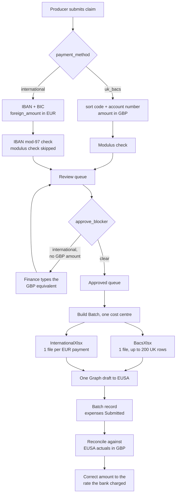

# International payments in the reimbursements portal

Planning doc, 2026-09-06. Source: `Bedlam International BACS Request Template.xlsx`, uploaded by
Mick and still untracked at the repo root (it belongs at `lib/reimbursements/templates/`).

Nothing is built yet. Design decisions below are settled with Mick; the remaining open items are
questions for EUSA finance, called out as such.

## What the template is

One **single-payment** form, not a batch. That is the whole architectural tension: the domestic
`EUSA_BACS_template.xlsx` carries 200 rows in one file, so a batch of 20 claims is one attachment.
An international batch of 20 is 20 files.

Sheet `FORM`, eight fillable cells (sheet `LISTS` backs the dropdowns):

| Cell | Field | Example | Notes |
|---|---|---|---|
| `C8` | PAYEE | `pretix` | merged `C8:E8` |
| `C9` | DESCRIPTION OF EXPENSE | `invoice R202402861 (pretix fees)` | merged `C9:E9` |
| `C10` | AMOUNT € | `266.69` | numeric; format is `"£"#,##0.00` — EUSA's own bug |
| `E10` | DATE REQUIRED | `2024-04-10` | date, rendered `mm-dd-yy` (US) |
| `C11` | NOMINAL CODE | `432540` | |
| `E11` | COST CENTRE | `BED` | not `F40` — see open questions |
| `C12` | BIC/SWIFT CODE | `GENODEM1GLS` | leftover `00-00-00` sort-code format |
| `E12` | IBAN NUMBER | `DE34 4306 0967 1147 5589 00` | leftover `00000000` account-number format |

Pre-filled and left alone: `C14` SET UP IN CASH FLOW (`NOT REQUIRED`), `E14` BACKUP PROVIDED
(`YES`), `C22` DESIGNATION. Rows 17–27 are EUSA's authorisation and bank blocks, signed by hand.

Three live formulas pick the authorising role from the amount:

```
C18  =IF(C10<=999.99, LISTS!A9, LISTS!A12)
C19  =IF(C10>=1000,   LISTS!A11, LISTS!A12)
E18  =IF(C10>=10000,  LISTS!A13, LISTS!A12)
```

They read `C10`, so the amount must be written as a **number**. A string there breaks all three.

## What I verified (rubyXL round-trip)

Generated real workbooks and read them back with openpyxl, rather than assuming:

- **Survives** a parse-and-write: the `x14` data-validation extension behind the two dropdowns,
  all three authorisation formulas, the `LISTS` sheet, `xl/media/image1.jpeg` (the logo), styles,
  and `E10`'s date format.
- **`add_cell` destroys the cell's style.** Writing `C10` with `add_cell` turned `"£"#,##0.00`
  into `General`.
- **`change_contents` preserves it.** `ws[9][2].change_contents(1234.56)` kept `"£"#,##0.00`.
  This is the write call to use.
- Dropped and harmless: `customXml/_rels/*`, `customXml/itemProps*`, `[trash]/0000.dat`
  (Office metadata; ~10 KB).

The same `add_cell` bug is live in the **domestic** `BacsXlsx` today — every BACS spreadsheet EUSA
has received shows a bare `1234.56` instead of `£1,234.56`. Cosmetic (the value is a real number,
so the GRAND TOTAL `SUM` is unaffected) and logged in
[off-topic-improvements.md](off-topic-improvements.md).

## Settled decisions

1. **EUR only.** No USD yet. `C10` receives the **EUR** amount, matching the template's label and
   its worked example.
2. **`payment_method` is the discriminator, not currency.** Currency and payment rail are
   different facts and they come apart — an international supplier can invoice in GBP, and you
   still need IBAN + this form. Deriving "is international" from `currency != "GBP"` bakes in an
   assumption that breaks the first time that happens.
3. **`amount` / `amount_excl_vat` keep their existing GBP meaning.** Nothing about budgets,
   `expected_outturn`, `NominalCodeRollup`, the over-budget check or reconcile changes. The EUR
   figure lives in its own column.
4. **Finance types the GBP figure at review**, and reconcile later corrects it with what EUSA's
   bank actually charged. No FX API, no judgement pushed onto producers, and the number ends up
   being the true one. Enforced structurally: a blank GBP `amount` is a **blocking** approval
   reason, so an international claim cannot be approved until finance has supplied it.
5. **One queue, one batch, one draft.** A Build Batch whose approved expenses include
   international claims emits the domestic xlsx *and* one international form per international
   claim, all attached to the same EUSA draft.

### Schema

| Table | Column | Notes |
|---|---|---|
| `reimbursements_expenses` | `payment_method` | `uk_bacs` (default) / `international`, not null |
| | `foreign_amount` | decimal(12,2), null for domestic — what goes in `C10` |
| | `foreign_currency` | string, null for domestic — `"EUR"` for now |
| | `iban_override`, `bic_override` | encrypted, mirroring the existing override trio |
| `reimbursements_payment_details` | `iban`, `bic` | encrypted, beside `sort_code`/`account_number` |

Named `foreign_amount` / `foreign_currency` rather than a bare `currency` deliberately: `amount`
is *always* GBP, so a column called `currency` sitting next to it would read as describing
`amount` and invite exactly the bug this design avoids.

The encrypted columns are **new**, with no plaintext rows, so the six-step rollout in
[encryption-rollout.md](../docs/reimbursements/encryption-rollout.md) collapses to "add `encrypts`
and deploy" — the backfill is a no-op. The CLAUDE.md rule reads as "always repeat the
sequence", so say so explicitly.

## Where the path diverges



## Status

**Phases 1-5 are built** (2026-09-06, branch `intl-payments`). Phase 6 (reconcile correcting the
GBP estimate) and IBAN/BIC on the finance expense-edit form are NOT done. The EUSA questions below
are still open and none of them blocks what shipped.

Two things were found by generating a real form and reading it back, rather than by the tests:

- **The template caches each formula's last computed value**, and those were EUSA's *sample*
  payment's answers, so a EUR 1,266.69 form rendered "UP TO £1,000: FINANCE TEAM CO-ORDINATOR"
  when their own rule sends £1,000+ to the Head of Finance. Every unit test passed while it was
  wrong. Fixed by setting `fullCalcOnLoad` *and* dropping the cached values (LibreOffice ignores
  the flag), verified end to end through LibreOffice.
- **The uploaded template was a filled-in sample, not a blank form** — it carried a real
  supplier's IBAN and two EUSA staff names. Blanked and scrubbed before it was committed.

Settled while building, beyond the five decisions below: the submitter enters EUR only (a blank
GBP amount is a blocking approval reason, which is what makes "finance types it at review"
structural rather than a convention), and an international claim's ex-VAT amount mirrors its gross.

## Build phases

Each lands as its own commit, tests first.

**1 — Schema and the model layer.** The migration above; `encrypts` on the four new bank columns;
`Expense#international?`; `EffectivePayee` gains `effective_iban` / `effective_bic` and
`effective_has_bank_details?` branches on the rail. `BankDetails` gains IBAN mod-97 and BIC shape
validation (pure functions, ~15 lines, no gem) and `mask` handles an IBAN.

**2 — Unblock approval.** The single change that gates everything else, and it is in **two**
places the code deliberately keeps in lockstep: `ReviewController#approve_blocker` returns
`:skipped_no_bank` unless `effective_has_bank_details?`, and `ReviewSupport.attention_summary`
adds `"no bank details"` on the same predicate — both requiring a sort code *and* an account
number. An IBAN-only claim has neither, so **no international claim could ever be approved** until
both branch. New international blocking reasons: no IBAN/BIC, no `foreign_amount`, no GBP
`amount`. The modulus check is skipped rather than run and failed.

Open detail: `amount_excl_vat` is blocking today. A foreign invoice carries no reclaimable UK VAT,
so for international it should default to the GBP `amount` rather than asking anyone to split it.

**3 — The form generator.** `Reimbursements::InternationalXlsx`, modelled on `BacsXlsx`: same
`TemplateError`, same `CellSanitizer` pass over payee and description, same blank-cost-centre
refusal, `change_contents` throughout, `@` forced on `C12`/`E12`. One `generate(payment)` returning
bytes.

**4 — Submission and review UI.** Payment method toggle on `ExpenseForm`, swapping sort
code/account number for IBAN/BIC and amount for EUR amount. A GBP field on the review screen.
`payment_reference` is required by `ExpenseForm` but **has no cell on this form** — decide whether
to relax it for international or fold it into the description.

**5 — Batch integration.** `BatchProcessor#build_xlsx` partitions approved expenses by rail: UK →
one `BacsXlsx` (**skipped entirely when the partition is empty**, or a batch of only international
payments generates a spreadsheet with no rows), international → N forms. Attachments become
`[domestic xlsx if any] + [N international forms] + receipts`; each international form uploads to
SharePoint too. `MAX_ROWS` applies to the UK partition only. `FilenameSanitizer` needs a
per-payment variant, since these are one file each rather than one per batch. Everything
downstream — the Batch record, `mark_submitted`, producer notifications, the cardinal rule and the
orphan-draft guard — is unchanged, because there is still exactly one draft.

**6 — Reconcile. DONE** (2026-09-06, branch `intl-reconcile`).

`match_debit_to_expense` took a penny window (`AMOUNT_TOLERANCE`), but an international claim's
stored `amount` is finance's GBP estimate while the actual is what the bank charged after the FX
spread: pounds apart on a €267 invoice, not pence. Every international claim would have sat
unmatched forever, stuck Submitted with its budget line frozen on the estimate.

- **A percentage window for international claims only** (`INTERNATIONAL_TOLERANCE_RATE`, 5%),
  floored at the penny so a tiny claim does not get a sub-penny window. The UK rail keeps the
  penny: widening it there buys nothing and costs a wrong link, which the governing asymmetry
  says is the worse error. Read off the EXPENSE, since nothing on the actuals row says a payment
  went out over SWIFT (checked against the BED 25/26 sheet) and nothing needs to.
- **`DatabaseStore#settle_expense_from_actual!`** is now the one settle path, marking the claim
  Paid and correcting an international amount to what EUSA charged. A UK amount is never
  overwritten: it is what the producer spent, not a guess.
- **A manual "Link to claim"** on the Actuals index (`ActualsController#link_expense` /
  `#confirm_link`), for the rows the matcher still declines. It is the backstop under the widened
  window and under the matcher's deliberate conservatism.

## Open questions for EUSA finance

Two of the three originally listed here were overstated and are dropped (Mick, 2026-09-06):

- ~~Cost centre~~ — **not a question.** `BED` is simply the termtime cost centre, and the sample
  was a termtime payment. The form takes `@cost_centre.eusa_code` exactly as the BACS spreadsheet
  does, so a termtime batch writes BED and a Fringe batch writes F40 on its own.
- ~~One email or several~~ — **a preference, not a fork.** Every form goes on the one draft
  alongside the spreadsheet. Each still carries its own signature block, so sharing an email does
  not merge their approval paths. Leave it unless EUSA asks otherwise.
- **Does the authorisation row populate when EUSA opens it?** The narrow, checkable version of
  "will they accept a machine-filled form", which was too vague to act on. It is their own
  template filled in the cells a human fills, so there is no reason to expect a policy objection.
  But rows 18–19 are the one part deliberately left to *recalculation* rather than computed here
  (the thresholds are EUSA's to change), so they populate in Excel via `fullCalcOnLoad` and render
  BLANK in a reader that ignores the flag — LibreOffice does, verified. One sample settles it.

## Traps, for whoever builds it

- Write `C10` as a **number** or the three authorisation formulas break.
- Use `change_contents`, never `add_cell`, or the currency format is lost.
- The authorisation formulas compare `C10` against **GBP** thresholds (999.99 / 1,000 / 10,000)
  while it holds **EUR**. That is EUSA's template doing the wrong comparison, and it is not ours
  to fix — but it means a €1,050 payment picks a different authoriser than a £1,050 one. Mention
  it when confirming the currency with them.
- Force `C12`/`E12` to text format (`@`). Real BIC and IBAN values always contain letters so the
  leftover numeric formats are harmless in practice, but `BacsXlsx#text_cell` sets the precedent.
- Run every free-text cell through `CellSanitizer` — payee and description are submitter-controlled.
- Refuse a blank cost centre, mirroring `BacsXlsx`'s guard: a wrongly-stamped centre pays from the
  wrong pot.
- `BankDetailsRetention` must clear IBAN/BIC on the same six-month rule, and
  `User#erase_reimbursements_bank_details` must destroy them, or they are a retention hole.
- The `\x80` bytes in the `SET UP IN CASH FLOW` / `DESIGNATION` labels are EUSA's own mojibake.
  Leave them; rewriting the labels defeats the point of filling their template.
